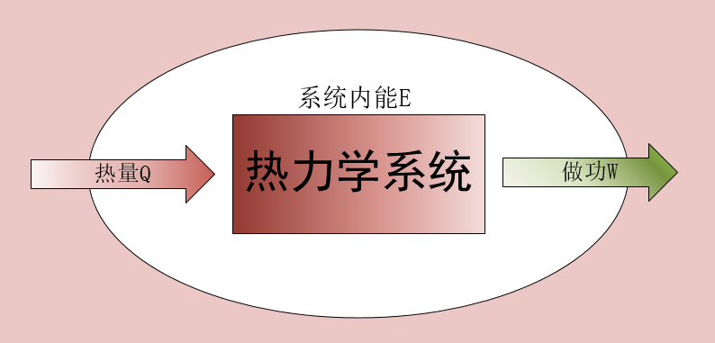

# 热力学基础

## 功、内能、热量 ★★

理想气体状态方程：$pV=vRT$

### 1.气体的功

气体体积由$V_1$变到$V_2$时气体对外做功：$W=\int^{V_2}_{V_1}p\,dV$
		$V_2>V_1,W>0$,表示气体对外做正功
		$V_2<V_1,W<0$,表示气体对外做负功

### 2.内能E

内能$E$是状态的**单值函数**，由$(p,V,T)$决定（$p$、$V$、$T$中只有两个独立变量），其增量只与始末状态有关，与过程无关。

对于**理想气体**，$E=E(T)$是温度的**单值函数**。

### 3.热量与热功当量

#### 热传递

当系统与外界温度不同时，就会通过分子间的相互作用而发生能量传递，这种过程成为“热传递”。

条件：$T_内\neq T_外$

#### 热量Q

热量是系统与外界热能转换的量度，热量是过程量。

$Q>0$,表示系统从外界吸热
$Q<0$,表示系统向外界放热

#### 热功当量

功与热量具有**等效性**，传递的热量和所做的功总有一定的比例关系：
$$
1卡热量 = 4.18焦耳的功
$$
>卡路里（简称卡），其定义为在1个大气压下，将1克水提升1摄氏度所需要的热量。

改变内能的方法：**做功**和**热传递**

## 热力学第一定律 ★★

外界对系统做**功**和传递给系统的**热量**之和等于系统**内能的增量**，记作：
$$
\Delta E_{int} = Q + W
$$
>  该写法与我们教科书上不一样，书上写作 $Q=\Delta E + W$，该处W的方向是系统向外界做功，而维基百科上的W方向是外界对系统做功。
> 																														————尼斯湖水怪

其微分形式：
$$
d E = \delta Q + \delta W
$$

> #### 细节扩充：
> (1)内能是**状态量**，功和热量是**过程量**。
> (2)热力学第一定律适用于**任何**系统的**任何**过程。
> (3)热力学第一定律对**各种**形态的物质系统都适用，只要求**始末**二态为**平衡态**，中间过程可以是平衡过程，也可以是非平衡过程。
> (4)功与热之间的转换**不是直接**的，总是通过物质系统来完成。
> (5)否认了第一类永动机。

###  课本记法

热力学第一定律的另一种形式：

系统接收的**热量**一部分转化为系统**内能**，另一部分对外**做功**。
$$
Q=\Delta E + W
$$
> 为了很好得描述热机的工作原理，我们使用的通常是这个公式
> 																														————尼斯湖水怪

## 热力学过程 ★★★★

热力学过程分四种：

1. 等体过程
2. 等温过程
3. 等压过程
4. 绝热过程

### 气体热容

摩尔热容：若1 mol物质温度升高$dT$时，吸收热量$dQ$，则摩尔热量为
$$
C_m = \frac{dQ}{dT}\quad (\mathrm{J\cdot K^{-1}\cdot mol^{-1}})
$$
> 与初中物理的**比热容**相区分，比热容$C=\frac 1m \frac{dQ}{dT}$，其中m为物质的质量。
>
> 注意这里是指$1 \,\,\mathrm{mol}$物质满足这个表达式，若有$\mu \,\,\mathrm{mol}$，则
>$$
> \int dQ=\mu C_m \int dT
>$$

### 等体热容和等压热容

不同的热力学过程，其摩尔热容是不一样的。

在等体过程中，定义等体热容
$$
C_{V,m}=\frac{dQ_V}{dT}
$$
> 理想气体的$C_{V,m}$是这么推得的：
>
> 根据气体分子运动论中的**能量均分定理**，可知$1 \,\,\mathrm{mol}$的理想气体的内能为温度T的单值函数
> $$
> E(T)=\frac i2 R T
> $$
> 故根据等体热容的定义
> $$
> C_{V,m}=\frac{dQ_{V}}{dT}=\frac i 2 R
> $$
> 

在等压过程中，定义等压热容
$$
C_{p,m}=\frac{dQ_p}{dT}
$$
**理想气体的$C_{V,m}$和$C_{p,m}$是常数**

####  迈耶公式
其中1 mol 气体的定压热容和定容热容具有数量关系
$$
C_{p,m}=C_{V,m}+R
$$
且该表达式对**非理想气体**仍然成立，其中R为普适气体常数。 $R=8.314 \,(\mathrm{J\cdot K^{-1}\cdot mol^{-1}})$ 

> 该公式由下推得：
>
> 首先通过定义，对于$1 \,\,\mathrm{mol}$的**理想气体**
> $$
> C_{p,m}=\frac{dQ_{p}}{dT}
> $$
>
> 根据[热力学第一定律](###课本记法 (重要★★★))
> $$
> Q_p=E+W
> $$
> 故
> $$
> C_{p,m}=\frac{dE}{dT}+p\frac{dV}{dT}
> $$
> 我们知道在等体过程中$Q = \Delta E$，故$\frac{dE}{dT}$即为**定体热容**$C_{V,m}$
>
> 并且，由**理想气体**的状态方程
> $$
> pV=\mu R T
> $$
> 可得当$\mu=1\,\,\mathrm{mol}$的时候$p\frac{dV}{dT}=R$，故原式可以化成
> $$
> C_{p,m}=C_{V,m}+R
> $$
> 即为最终的**迈耶公式**

### 等体过程

保持容器的**容积**不变，这意味着 $dV=0$，从而 $W=\int p dV = 0$，由[热力学第一定律](###课本记法 )可得
$$
Q=\Delta E
$$
即系统接收的**热量**完全转换为系统的**内能**，对外**不做功**

有$\frac p T =\frac{\mu R}{V} = const$，即**温度**与**压强**成**正比例**关系

此时状态如下
$$
\left\{
\begin{align}
&Q=\mu C_{V,m} (T_2-T_1)\\
&\Delta E=\mu C_{V,m} (T_2-T_1)\\
&W=0\\
\end{align}
\right.
$$

### 等压过程

保持气体**压强**不变

此时系统接收的**热量**，一部分转换为系统的**内能**，一部分对外**做功**

有$\frac V T =\frac{\mu R}{p} = const$，即**温度**与容器**容积**成**正比例**关系

此时状态如下
$$
\left\{
\begin{align}
&Q=\mu C_{p,m} (T_2-T_1)\\
&\Delta E=\mu C_{V,m} (T_2-T_1)\\
&W=\mu R(T_2-T_1)\\
\end{align}
\right.
$$
> 此处系统对外做功$W$还可以这么计算：
>
> 由于气体**压强**恒定，根据气体做功的表达式，有
> $$
> W=\int^{V_2}_{V_1}p dV = p(V_2-V_1)
> $$
> 实际上，根据理想气体的状态方程，$\mu R T=p V$，所以它们是一回事儿

### 等温过程

保持气体**温度**不变，这意味着$dT=0$，，从而$\Delta E =0$,由[热力学第一定律](###课本记法)可得
$$
Q=\Delta E
$$
> 由于**内能**为**温度**的**单值函数**，因此若气体**温度**不变，系统**内能**也不会改变。
>																														————尼斯湖水怪

此时系统接收的**热量**，完全用于对外**做功**，系统**内能**保持不变

有$pV=\mu R T=const$，即**压强**与气体**容积**成**反比例**关系

此时状态如下
$$
\left\{
\begin{align}
&Q=\mu R T \ln\frac{V_2}{V_1}\\
&\Delta E=0\\
&W=\mu R T \ln\frac{V_2}{V_1}\\
\end{align}
\right.
$$
> 当改变容器**容积**，气体**压强**也会随之改变，根据气体对外做功的表达式，可推得
> $$
> W=\int^{V_2}_{V_1}p dV =\int^{V_2}_{V_1}\frac{\mu R T}{V}dV=\mu R T\ln\frac{V_2}{V_1}
> $$
> 又因
> $$
> \frac{V_2}{V_1}=\frac{p_1}{p_2}
> $$
> 故又有
> $$
> W=\mu R T \ln{p_1}{p_2}
> $$

### 绝热过程

系统与外界不交换**热量**，这意味着$Q=0$，由[热力学第一定律](###课本记法)可得
$$
W=-\Delta E
$$
此时状态如下
$$
\left\{
\begin{align}
&Q=0\\
&\Delta E=\mu C_{V,m}(T_2-T_1)\\
&W=-\mu C_{V,m}(T_2-T_1)\\
\end{align}
\right.
$$

> 此处推导绝热过程的状态方程：
>
> 首先$Q=0$，由热力学第一定律得
> $$
> \Delta E + W = Q = 0\\
> \mu C_{V,m} dT + pdV = 0
> $$
> 由于在这个过程中气体**压强**、容器**容积**和气体**温度**是我们需要研究的变量
>
> 所以，我们对气体状态方程$pV=\mu RT$微分，得到
> $$
> pdV + Vdp = \mu RdT
> $$
> 联立两式
> $$
> \left\{
> \begin{align}
> &\mu C_{V,m}\,dT + p\,dV = 0\\
> &p\,dV + V\,dp = \mu R\,dT
> \end{align}
> \right.
> $$
> 消去$dT$得到
> $$
> \frac{C_{p,m}}{C_{V,m}}p dV +V dp = 0
> $$
> 其中$\frac{C_{p,m}}{C_{V,m}}$即为**热容比**，又称**绝热指数**，记作$\gamma$
>
> 将其变形，得
> $$
> \gamma\,\frac{dV}{V}=-\frac{dp}{p}
> $$
> 解得
> $$
> pV^{\gamma}=const
> $$
> 这就是绝热过程的**状态方程**
>
> > 这个状态方程一共有三种形式：
> >
> > 1. $pV^{\gamma}=const_1$
> > 2. $TV^{\gamma-1}=const_2$
> > 3. $p^{\gamma-1}T^{-\gamma}=const_3$
>
> ---
>
> 此外，该过程中做功表达式也有另一种形式：
>
> 联立以下表达式(该状态下满足$W=-\Delta E $)
> $$
> \left\{
> \begin{align}
> &\gamma=\frac{C_{p,m}}{C_{V,m}}\\[2mm]
> &C_{p,m}=C_{V,m}+R\\[3mm]
> &W=-\mu C_{V,m} (T_2-T_1)
> \end{align}
> \right.
> $$
> 得
> $$
> W=-\frac{\mu R (T_2-T_1)}{\gamma - 1}
> $$
> 又根据物态方程$pV=\mu RT$，得
> $$
> W=-\frac{p_2 V_2-p_1 V_1}{\gamma - 1}
> $$
> > 特别需要注意的是，绝热过程中**初态**($p_1,V_1,T_1$)和**末态**($p_2,V_2,T_2$)的三个状态变量都是不一样的。
> > ​																														————尼斯湖水怪

