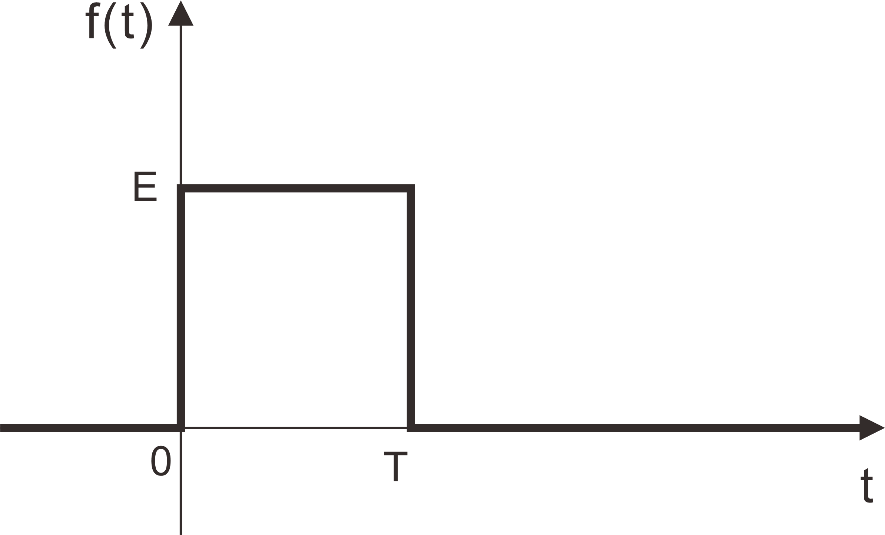

# 傅里叶积分示例

​		傅里叶变换的积分表达式如下
$$
F(\omega) = \frac{1}{2\pi} \int^{\infty}_{-\infty}f(t)\ \mathrm e^{-j\omega t}\,dt
$$
​		本文就如何使用该积分得到时域信号的频谱图做一个详细的解释

## 示例1

如图所示信号

带入公式进行积分
$$
\begin{align}
F(\omega) &= \frac{1}{2\pi} \int^{T}_{0}E\ \mathrm e^{-j\omega t}\,dt\\[2mm]
&=\frac{E}{-j2\pi\omega}\left[ \mathrm e^{-j\omega t}\right]^T_0\\[2mm]
&=\frac{E}{-j2\pi\omega}(\mathrm e^{-j\omega T}-1)\\[2mm]
&=\frac{E}{-j2\pi\omega}(\cos(\omega T)-j\sin(\omega T)-1)\\[2mm]
&=\frac{E}{2\pi\omega}[\sin(\omega T)+j(\cos(\omega T)-1)]\\[2mm]
\end{align}
$$
因此
$$
|F(\omega)| =\frac{E}{\pi\omega}(1-\cos(\omega T))
$$
假设我们的信号是 $E=1$ , $T = 1$ ，则
$$
|F(\omega)| = \frac{1}{\pi\omega}(1-\cos(\omega))
$$
下面是用matlab画出来的图像

​		会发现，该图并不是标准的**抽样函数**，我们将该波形进行采样，然后重构时域的波形。