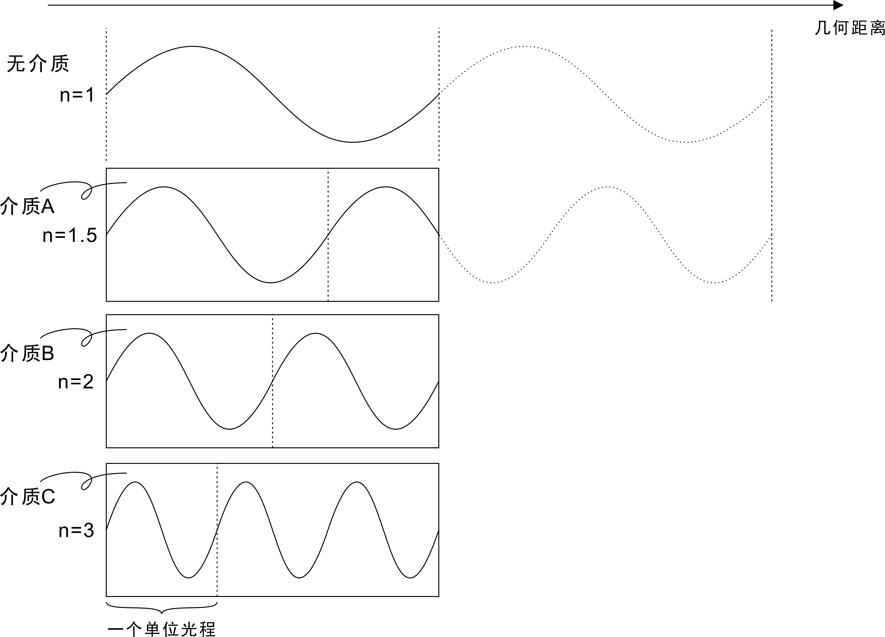
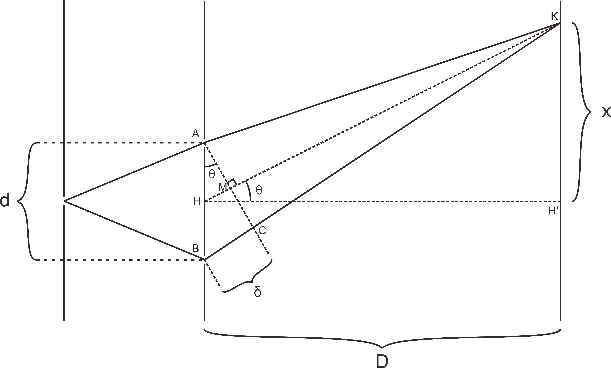
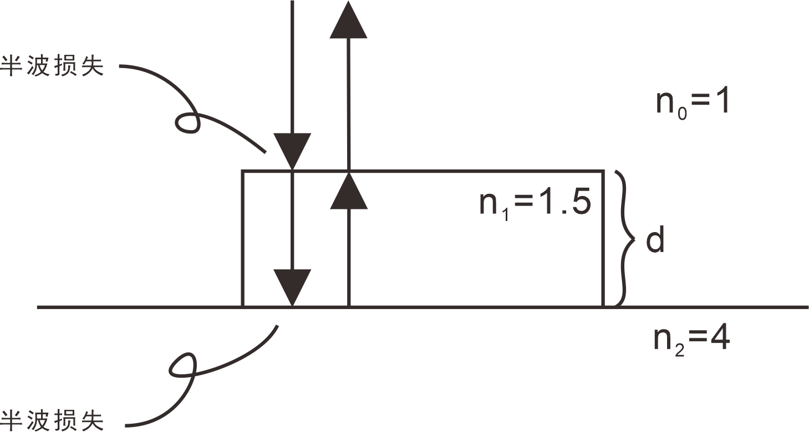
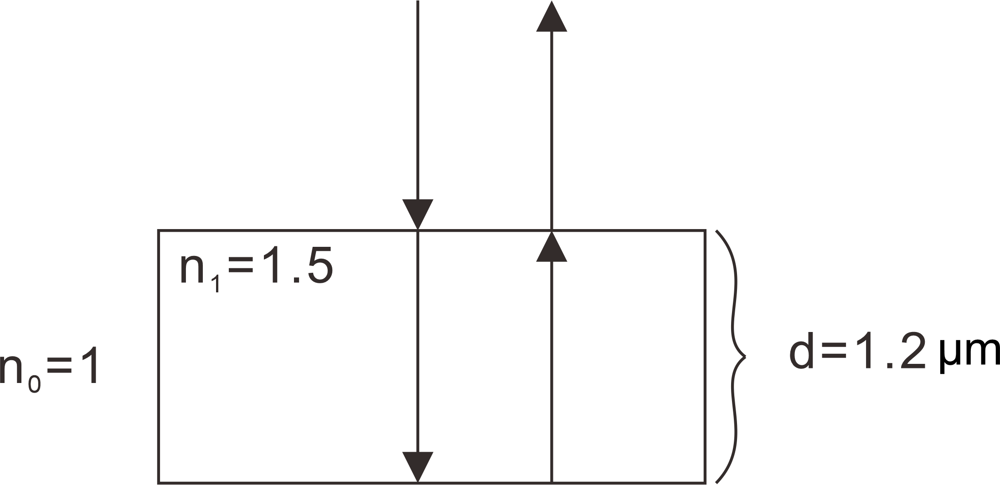
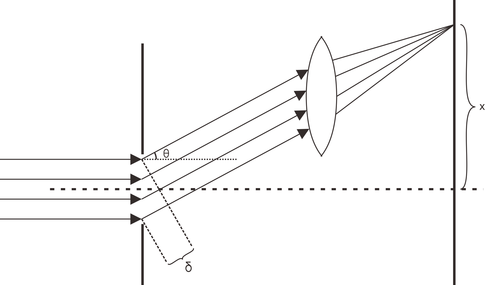
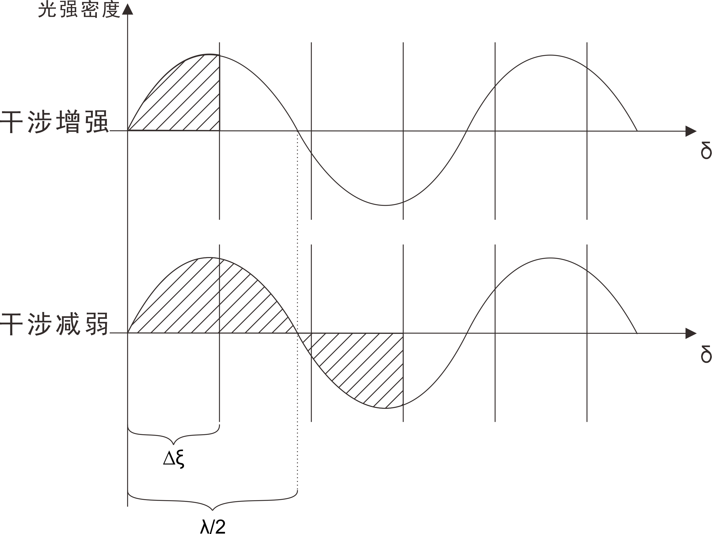

# 光的干涉

## 例题1

​		波长为 $\lambda$ 的单色光在折射率为 $n$ 的媒质中由 $a$ 点传到 $b$ 点，相位改变了 $\pi$ ，则光从 $a$ 点到 $b$ 点的几何距离为？

该单色光在折射率为 $n$ 的媒质中的波长 $\lambda'$ 满足
$$
\lambda'=\frac{\lambda}{n}
$$
设 $a$ 点到 $b$ 点的几何距离为 $x$ ，则有
$$
\phi_{ab} = x \, \frac{2\pi}{\lambda'} = \pi
$$
则
$$
x = \frac{\lambda'}{2}=\frac{\lambda}{2n}
$$

这里需要牢记波的**相位** $\phi$ 和**距离** $x$ 之间的比例关系：
$$
\frac{\phi}{2\pi}=\frac{x}{\lambda}
$$

## 例题2

​		下列说法中正确的是？

1. 相等光程的几何距离必然相等
2. 光行进相同的光程，经历的时间必然相等
3. 几何距离越大的，其光程必然较大
4. 相同的光程必然有相同的对应的真空距离

### 辨析1

光程可以理解为将不同介质中光走过的几何距离折算到真空中的距离

​		光在真空中传播时 $n=1$ ，而到了折射率不同的介质中时，光的波长变为了在真空中时波长的 $\frac1n$ ，所以光在单位几何距离内通过的光程变长了。

​		（上图中虚线表示一个单位光程，随着折射率变大，单位光程的几何距离缩小了）

​		比较四张图，同样一段几何距离，光在真空中通过了一个单位光程，而在介质 C 中通过了三个单位光程。

通过上述理解，我们可以总结这样一个规律：若总光程为 $r$ ，通过折射率分别为 $n_1$ 和 $n_2$ 的介质，其几何距离 $x_1$ 和 $x_2$ 有如下关系：
$$
r=n_1x_1=n_2x_2
$$
换句话说，光程一定，介质折射率越大，几何距离越短；介质折射率越小，几何距离越长。

这个原理同时也可以解释波从一个介质进入另一个介质的时候，**频率**、**波长**、**波速**的变化情况：

​		当波从**光疏媒质**进入**光密媒质**中时，频率不变，波长变小，导致波速变小

​		当波从**光密媒质**进入**光疏媒质**中时，频率不变，波长变大，导致波速变大

### 辨析2

由辨析1已经解释，相同的光程，其几何距离不一定相同。

**但是**，不同介质中波的传播速度也不同，请看如下推导

若有一在真空中波长为 $\lambda$ 的单色光，以光速 $c$ 进入折射率为 $n$ 的介质中，假设光进入介质后波长变为 $\lambda'$ ，其速度为 $v$ 

对于光的传播，有如下表达式成立
$$
c = f\,\lambda 
$$
进入介质之后，频率不变，而波长改变
$$
\lambda'=\frac{\lambda}{n}\\
$$
因此
$$
v = f\,\lambda'=\frac{f\,\lambda}{n}=\frac{c}{n}
$$
假设在真空中，光走过光程为 $l$ 其对应的几何距离 $l$ 所需要时间为 $t$ 
$$
t=\frac{l}{c}
$$
则在介质中，光走过光程为 $l$ 其对应的几何距离 $l'=\frac{l}{n}$ 所需要的时间为 $t'$ 
$$
t' = \frac{l'}{v}=\frac{\frac{l}{n}}{\frac{c}{n}}=\frac{l}{c}=t
$$

### 辨析3

**几何距离**、**光程**和介质**折射率**之间的关系，可以这么描述

设几何距离为 $x$ ，光程为 $r$ ，介质折射率为 $n$ ，则
$$
r = n x
$$

所以几何距离越大，除非折射率一定，否则光程不一定越大。

### 辨析4

光程一定，意味着波在各种介质中传播的几何距离，折算到真空中传播的几何距离相同。

### 综上

选项1和3是错的，2和4是对的，但为了尊重参考答案，选4

## 例题3

​		在杨氏双缝实验中，为使屏上干涉条纹间距变大，可采用的办法是？

设屏与缝之间的距离为 $D$ ，两缝之间相距为 $d$ ，则 $k$ 级明纹与零级明纹之间的距离为 $x_k$ ，则杨氏双缝实验的亮纹分布为
$$
x_k = \frac{D}{d}k\lambda \qquad (k=0,\pm 1,\pm 2,\pm 3,\cdots)
$$
相邻两条亮纹之间的距离为
$$
\Delta x = x_{k+1}-x_k = \frac{D}{d}\lambda
$$
要使得条纹间距变大，可以减小 $d$ 或者增大 $D$ 或 $\lambda$ 

这里我将完整地理一下杨氏双缝实验公式推导：

如上图所示，过两缝A与B的中点H做一条与水平线HH'夹角 $\theta$ 的直线，与屏幕交于一点K ，过A点做HK的垂线AM与BK交于点C

要明确的是，上图只画出了对于一个特定的 $\theta$ 时的情况，实际上，对于 $\theta$ 在 $(-\frac{\pi}{2},\frac{\pi}{2})$ 中任意的取值，都能找到一个唯一确定的K点与之对应，我们就是借此分析右方的屏上呈现的所有情况。

在刚刚所做的辅助线中，存在一对相似三角形
$$
\Delta \mathrm{AMH}\sim \Delta\mathrm{HH'K}
$$
这时
$$
\angle \mathrm{HAM} = \angle\mathrm{H'HK} = \theta
$$
将边长和角度关联起来，有
$$
\delta = d\sin\theta\\
x = D \tan \theta
$$
由于实际情况 $\theta\ll 1$ ，这个时候，使用**等价无穷小**简化表达式，最终得到
$$
\delta \approx d\theta\\
x \approx D\theta
$$
这个时候有
$$
x = \frac{D}{d}\delta
$$
其中 $\delta$ 为从点A与点B射出的相干光的光程差，其大小决定了条纹分布：
$$
\delta
=
\left\{
\begin{align}
&\pm k\lambda,明纹\\
&\pm (k+\frac12)\lambda ,暗纹
\end{align}
\right.
$$
带入上式就有
$$
\delta
=
\left\{
\begin{align}
&\pm\frac{D}{d} k\lambda ,明纹\\
&\pm\frac{D}{d}  (k+\frac12)\lambda , 暗纹
\end{align}
\right.
$$

## 例题4

​		硅 ($n=4$) 片上的二氧化硅 ($n=1.5$) 薄膜，对由空气垂直入射的波长为 $570\,\mathrm{nm}$ 的黄光反射加强，则薄膜的厚度至少为？

设该薄膜厚度为 $d$ ，已知该黄光的波长为 $\lambda$ ，光从空气中射入薄膜到垂直反射回空气中，经历了两个半波损失，设光程差为 $r$ ，其**干涉加强**的条件满足
$$
r = 2n_1d + \lambda = k\lambda \qquad(2,3,4,\cdots)
$$
可以解得
$$
d = \frac{(k-1)\lambda}{2n_1}\qquad(2,3,4,\cdots)
$$
当 $k=2$ 的时候，$d=190\,\mathrm{nm}$ 最小

## 例题5

​		杨氏双缝的间距为 $0.2\,\mathrm{mm}$ 距离屏幕为 $1\,\mathrm{m}$ 求：

​		(1). 若第一到第四明纹的距离为 $7.5\,\mathrm{mm}$ ，求入射光波长

​		(2). 若入射光的波长为 $600\,\mathrm{nm}$ ，求相邻两明纹的间距

### 解析1

已知 $D = 1\,\mathrm{m}$ , $d = 0.2\,\mathrm{mm}$ 

第一明纹位置 $x_1$ 和第四明纹位置 $x_2$ 为
$$
x_1 = 1\cdot\frac{D}{d}\lambda\\
x_4 = 4\cdot\frac{D}{d}\lambda
$$
距离差为
$$
\Delta x = x_4-x_1 = 7.5\,\mathrm{mm}
$$
由此可得
$$
\lambda = \frac13 \frac dD \Delta x \approx 500\,\mathrm{nm}
$$

### 解析2

设第 $k$ 级明纹的位置为 $x_k$ ，有
$$
x_k = \frac D d k\lambda
$$
相邻两个明纹间距为
$$
\Delta x = x_{k+1}-x_k = \frac Dd\lambda = 3\,\mathrm{mm}
$$

## 例题6

​		一块厚 $1.20\,\mathrm{\mu m}$ 的折射率为 $1.50$ 的透明膜片，设以波长介于 $400\sim760\,\mathrm{nm}$ 的可见光垂直入射，求反射光中哪些波长的光最强？

如图所示，设射入光线与射出光线的光程差为 $\delta$ ，则出现亮纹的区域满足
$$
\delta = 2n_1d+\frac \lambda 2 = k\lambda\qquad (k=0,\pm 1,\pm 2,\cdots)
$$
故有
$$
\lambda = \frac{2n_1d}{k-\frac 12} \qquad(k=1,2,3,\cdots)
$$
可以列出来
$$
\begin{align}
&k = 5 && \lambda = 800\,\mathrm{nm}\\
&k = 6 && \lambda \approx 655\,\mathrm{nm}\\
&k = 7 && \lambda \approx 554\,\mathrm{nm}\\
&k = 8 && \lambda = 480\,\mathrm{nm}\\
&k = 9 && \lambda \approx 424\,\mathrm{nm}\\
&k = 10 && \lambda = 379\,\mathrm{nm}\\
\end{align}
$$
在这之中可取 $6\leq k\leq 9$ ，即满足条件的波的波长为 $655\,\mathrm{nm}$、$554\,\mathrm{nm}$、$480\,\mathrm{nm}$、$424\,\mathrm{nm}$ 。

# 光的衍射

## 例题1

​		以波长为 $660\,\mathrm{nm}$ 的单色平行光垂直照射到宽度 $a=0.20\,\mathrm{mm}$ 的单缝上，设某级衍射暗纹出现在 $\theta=\arcsin(0.0165)$ 的方向上，则单缝处的波阵面对该方向而言可分成\_\_\_\_\_\_个半波带，该暗纹的级次为\_\_\_\_\_\_ 。

光线通过该狭缝发生衍射，表现出波动性，向前方各个方向发散开来，考虑其中一个方向 $\theta$ 的情况，在 $x$ 位置出现暗条纹的条件必须满足
$$
\delta = a\sin\theta = \pm 2k\cdot\frac\lambda2 \qquad(k=1,2,3,\cdots)
$$
在这里注意 $k$ 的取值是从 $1$ 开始，不包括 $k=0$ 的情况，因为中央明纹比较特殊，中央明纹的宽度为其他相邻明纹宽度的**两倍**！

由题目给出的数据可以求得光程差 $\delta$ 为
$$
\delta = a\sin\theta = 0.2\,\mathrm{mm}\ \times 0.0165 = 3.3\,\mathrm{\mu m}
$$
很显然
$$
3.3\,\mathrm{\mu m}=10 \times \frac\lambda 2
$$
即光程差 $\delta$ 中含有 $10$ 个半波带，即 $2k=10$ ，因此是第 $5$ 级暗纹。

在此处补充一些对于单缝衍射**半波带法**的理解

衍射的本质也是干涉，干涉一般意义上理解为两列或者两列以上的波在空间中发生叠加，导致新生成波的某一部分始终**相长**，另一部分始终**相消**的现象。

教科书上的 “干涉” 一般是指两个波源之间的干涉，而衍射是指无穷个连续波源共同作用的干涉。

**半波带法**是一种分析单缝衍射的近似方法，它仅仅考虑相邻两个半波带之间的干涉，而实际情况则是任意波带间都会发生干涉。

如上图所示，狭缝的上边沿到下边沿之间通过的光线有无数条，根据惠更斯原理的阐述，每一条光线都可以看作是一个单独的波源，屏上每一个点处的光照强度都是所有波源叠加的结果。

​		观察上图，光强即为阴影部分面积，可以看见，偶数倍的半波带会两两相消，奇数个半波带就不会。

​		**在此补充，上图是不准确的，实际图像并非每个波带相等，半波带法本身是为方便计算而得到的近似方法，该近似在 $\theta$ 越小的地方越不准确，该图中的前面几段实际是不合理的，这里仅仅为了方便理解。**

## 例题2

​		在单缝夫琅禾费衍射实验中，波长为 $\lambda$ 的单色光垂直入射在宽度 $a=5\lambda$ 的单缝上，对应于衍射角 $\theta$ 的方向上，若单缝处的波面恰好可以分成 $5$ 个半波带，则衍射角 $\theta$ = \_\_\_\_\_\_ 。

$$
\begin{align}
a\sin\theta &= \pm 5\cdot\frac \lambda 2\\[1mm]
5\lambda \sin\theta &= \pm 5\cdot \frac \lambda 2\\[1mm]
\sin\theta &= \pm \frac 12\\[1mm]
\theta &= \pm 30^\circ
\end{align}
$$

## 例题3

​		用波长为 $550\,\mathrm{nm}$ 的单色平行光垂直照射在没厘米刻有 $5000$ 条刻痕的平面光栅上，则此光栅的光栅常数为 \_\_\_\_\_\_ $\mathrm{nm}$ ，能观察到的完整谱线的最大级次为 \_\_\_\_\_\_ 级。

光栅常数为
$$
d = \frac{1\,\mathrm{cm}}{5000} = 2\,\mathrm{\mu m}=2000\,\mathrm{nm}
$$
还要记住光栅衍射中，干涉主极大值的分布
$$
d\sin\theta =
\pm k\lambda
\qquad (k=1,2,3,\cdots)
$$
最大级次的明纹出现在 $\sin\theta = 1$ 的时候
$$
d = k\lambda\\[2mm]
k=\frac{d}{\lambda} \approx 3.64
$$
因此 $k$ 最大可取 $3$ 

## 例题4

​		一束波长为 $\lambda$ 的单色平行光垂直照射到宽为 $a$ 的单缝上，若屏上的某点为第三级明纹中心，则单缝两边缘处光线之间的光程差为？

第 $k$ 级明纹中心满足
$$
\delta=a\sin\theta = \pm (2k+1)\cdot \frac{\lambda}{2}
$$
第三级明纹则取 $k=3$ 
$$
\delta = \pm \frac{7\lambda}{2}
$$

## 例题5

​		波长为 $\lambda$ 的单色平行光垂直照射到单缝上，若对应于某一衍射角 $\theta$ ，最大光程差 $\delta = \frac \lambda 2$ ，则屏上对应的 $P$ 点是？

由半波带法得到的光强分布表达式
$$
\delta = a\sin\theta = 
\left\{
\begin{align}
0,&&中央明纹\\
\pm k\lambda,&&暗纹中心\\
\pm (k+\frac12)\lambda,&&明纹中心
\end{align}
\right.
\qquad (k=1,2,3,\cdots)
$$

其中最小级次的暗纹中心在 $-\lambda$ 和 $\lambda$ 上，也就是说 $\frac \lambda 2$ 在中央明纹中，因此 $P$ 点在中央明纹内。

## 例题6

​		一束单色平面电磁波垂直照射在每厘米刻有 $4000$ 条刻痕的衍射光栅上，若第二级主最大出现在与法线成 $30^\circ$ 夹角处，则电磁波波长为？

光栅常数为
$$
d = \frac{1\,\mathrm{cm}}{4000} = 2.5\,\mathrm{\mu m}
$$
由题意得干涉主极大值分布
$$
d \sin\theta = \pm k \lambda \qquad (k=1,2,3,\cdots)
$$
第二级著最大取 $k=2$ ，有
$$
\lambda = \frac{d\sin\theta}{2} = 625\,\mathrm{nm}
$$
