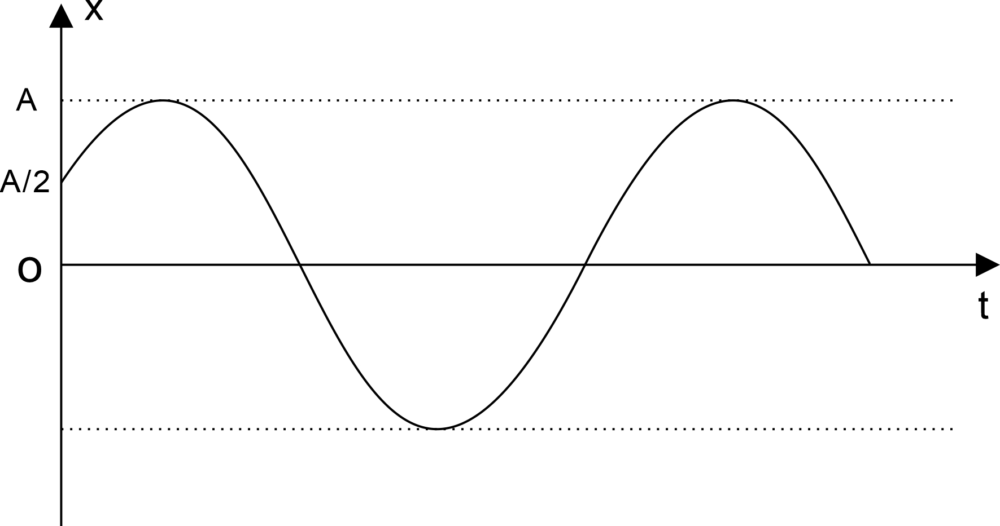
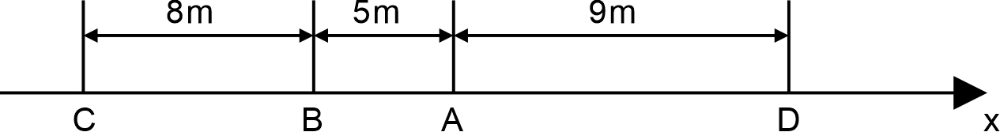
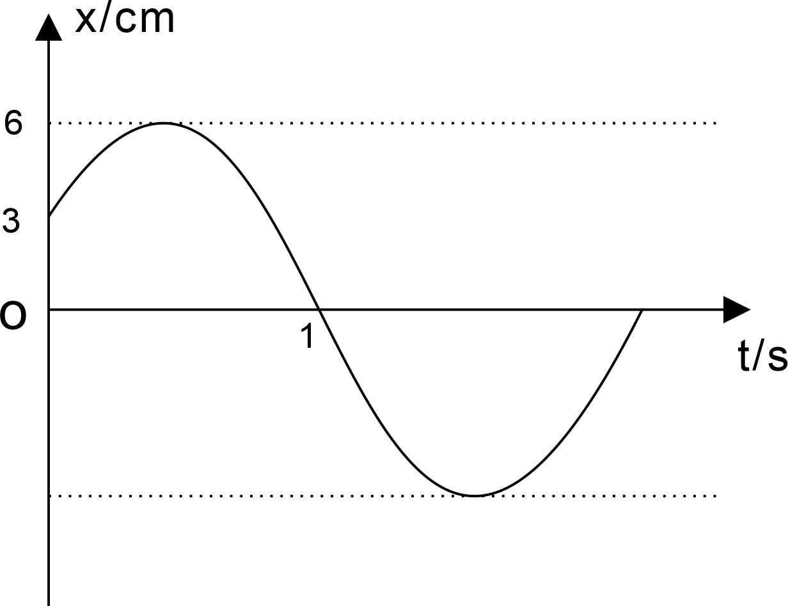
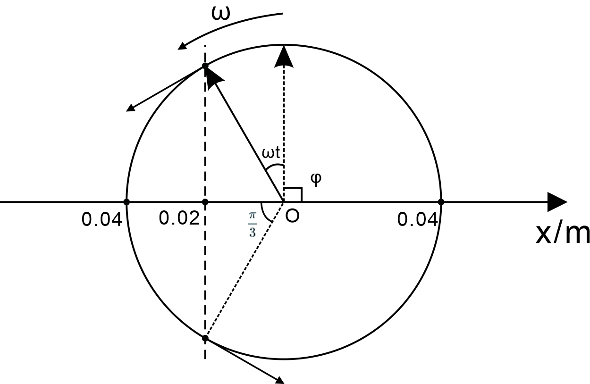
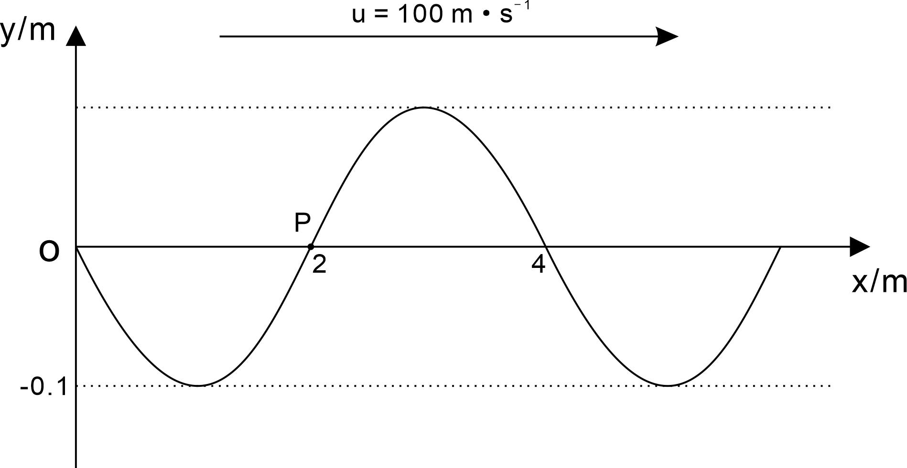
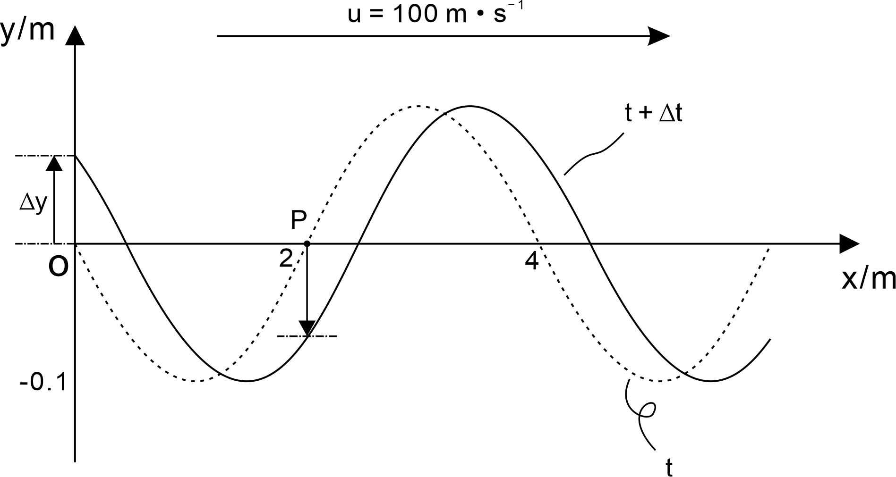

# 振动与波动例题解析

## 选择题

### 例题1

​		一物体做简谐振动，运动方程为 $x = A\cos(\omega t+\frac\pi4)$ ，在 $t=\frac T4$ 时刻 ($T$ 为周期) ，物体的速度和加速度为？

解：

​		已知运动方程，速度和加速度表达式如下
$$
v=\frac{dx}{dt} = -\omega A\sin(\omega t +\frac \pi 4)\\
a = \frac{d^2x}{dt^2}=-\omega^2A\cos(\omega t +\frac \pi 4)
$$
​		角频率与周期的关系 $\omega = \frac{2\pi}{T}$ ，带入可得
$$
x(\frac T4) = A\cos(\frac{3\pi}4)=-\frac{\sqrt 2}2 A
$$

$$
v(\frac T 4) = -\omega A \sin(\frac{3\pi}4)=-\frac{\sqrt 2}{2}A\omega
$$

$$
a(\frac T 4) = -\omega^2 A \cos(\frac{3\pi}4)=\frac{\sqrt 2}{2}A\omega^2
$$

### 例题2

​		质点做简谐振动，若其位移（实为位移在x轴上投影）与时间的曲线如图所示，则该质点做简谐振动的初相位为？

解：

​		设该简谐振动的方程为 $x=A\cos(\omega t +\phi)$ 

​		当 $t=0$ 时，令
$$
A\cos(\phi) = \frac A 2
$$
​		得到
$$
\cos(\phi ) = \frac 12\\
\phi = \pm \frac \pi 3
$$
​		观察图像，当 $t=0$ 时，有
$$
\frac {dx}{dt} = -\omega A\sin(\phi)>0\\
\sin(\phi)<0
$$
​		因此
$$
\phi = -\frac\pi3
$$

### 例题3

​		若一机械波的表达式为 $y=0.03\cos[6\pi(t+0.01x)+\frac{\pi}3] (\mathrm m)$ 则下面叙述正确的是？

A. 其振幅为 $3\mathrm m$ 

B. 其周期为 $\frac13\mathrm s$ 

C. 其波速大小为 $10\,\mathrm{m\cdot s^{-1}}$ 

D. 此波沿x轴正方向传播

解：

​		对照机械波的标准表达式
$$
y = A\cos[\omega(t+\frac{x}{u})+\phi]
$$
​		可得 $A=0.03\,\mathrm m$ 、$\omega = 6\pi\ \mathrm{rad\cdot s^{-1}}$ ，$u = 100\,\mathrm {m\cdot s^{-1}}$ ，$\phi = \frac \pi 3$ ，因此
$$
T = \frac{2\pi}{\omega} = \frac 13 \,\mathrm s
$$
​		因此选项A、C、D错误，只有B是对的

### 例题4

​		两列波是相干波的条件？

答：

	1. 频率相同
 	2. 传播方向相同
 	3. 相位差为零或相位差固定

### 例题5

​		波由一种介质进入另一种介质时，其传播速度、频率和波长的变化情况？

答：

​		波的频率只和波源的频率有关，和通过的介质无关，而波速与波长与介质有关。

​		当一个波由一种介质进入另一种介质时，频率不变，而传播速度与波长改变。

## 计算题

### 例题T1

​		如图所示，一平面简谐波以速率 $u = 20\,\mathrm{m\cdot s^{-1}}$ 沿x轴正方向传播。已知在传播路径上某点 $\mathrm A$ 的简谐振动方程为 $y=3\times 10^{-2}\,\cos(4\pi t)$ ，式中 y 的单位为 $\mathrm m$ ， t 的单位为 $\mathrm s$ 。

(1). 以点 $\mathrm A$ 为坐标原点，写出简谐波振动方程

(2). 以距离 $\mathrm A$ 点 $5\,\mathrm m$ 处的 $\mathrm B$ 点为dd坐标原点，写出简谐波运动方程

(3). 写出传播方向上点 $\mathrm C$ 和点 $\mathrm D$ 的简谐振动方程

(4). 分别求出 $\mathrm B$ 、 $\mathrm C$ 两点和 $\mathrm C$ 、 $\mathrm D$ 两点间的相位差

解：

​		1、根据题目条件，已知
$$
\begin{align}
&u = 20\,\mathrm{m\cdot s^{-1}}\\[2mm]
&\omega = 4\pi\ \mathrm{rad\cdot s^{-1}}\\[2mm]
&T=\frac{2\pi}\omega = \frac 12\,\mathrm s\\[2mm]
&\lambda = Tu =10 \,\mathrm m
\end{align}
$$

​		故在 $\mathrm A$ 点处的波动方程为
$$
y(x,t) = 0.03 \cos(4\pi(t-\frac{x}{20})) (\mathrm m)
$$
​		2、距离 $\mathrm A$ 点相距 $5\,\mathrm m$ 的 $\mathrm B$ 点 ，可求得 $\mathrm A$ 与 $\mathrm B$ 间得相位差 $\phi_{AB}$ 为
$$
\phi_{AB} = -\frac{2\pi}{\lambda}\times(x_A-x_B) = -\pi
$$
​		可知 A 点相位比 B 点相位要滞后 $\pi$ ，因此以 B 点为原点的波动方程为：
$$
y_B(x,t) = 0.03 \cos(4\pi(t-\frac{x}{20})+\pi) (\mathrm m)
$$
​		3、继续以 B 点为参考点，C 点的简谐振动方程为当 $x = -8 \,\mathrm {m}$ 的时候，此时
$$
y_c(t) = y_B(-8,t) = 0.03\cos(4\pi t +\frac{13\pi}5)(\mathrm m)
$$
​		D 点的简谐振动方程为当 $x=14\,\mathrm m$ 的时候，此时
$$
y_d(t) = y_B(14,t) = 0.03\cos(4\pi t -\frac{9\pi}5)(\mathrm m)
$$
​		4、相位差如下
$$
\phi_{BC} = -\frac{2\pi}{\lambda} (x_B - x_C) = -\frac{8\pi}5
$$

$$
\phi_{CD} = -\frac{2\pi}{\lambda} (x_C - x_D) = \frac{22\pi}5
$$

### 例题T2

​		一质点做简谐运动，其运动方程为 $x=0.1\cos(3\pi t+\frac{2\pi}{3}) (\mathrm m)$ ，求

(1). 此振动的周期 $T$ 、振幅 $A$ 、初相位 $\phi$ 

(2). 速度的最大值 $v_{max}$ 和加速度的最大值 $a_{max}$ 

解：

​		1、对比简谐振动的标准方程
$$
x(t) = A\cos(\omega t + \phi)(\mathrm m)
$$
​		可知
$$
\begin{align}
&A=0.1\,\mathrm m\\[2mm]
&\omega = 3\pi \ \mathrm{rad\cdot s^{-1}}\\[2mm]
&T = \frac{2\pi}{\omega} = \frac 23\mathrm s\\[2mm]
&\phi = \frac{2\pi}{3}
\end{align}
$$
​		2、对运动方程关于时间求导，可得速度与加速度
$$
v(t) = \frac{dx}{dt} = -0.3\pi\sin(3\pi t + \frac{2\pi}3)(\mathrm {m\cdot s^{-1}})\\
a(t) = \frac{d^2x}{dt^2} = -0.9\pi^2\cos(3\pi t + \frac{2\pi}3)(\mathrm {m\cdot s^{-2}})\\
$$
​		可得速度最大值 $v_{max} = 0.3\pi\,\mathrm {m\cdot s^{-1}}$ 

​		最大加速度 $a_{max} = 0.3 \pi^2\,\mathrm {m\cdot s^{-2}}$ 

### 例题T3

​		某谐振子的位移（实为位移在x轴上的投影）时间曲线如下图所示，求其振动方程。

解：

​		设振动方程为
$$
x(t) = A\cos(\omega t +\phi)
$$
​		由图可知
$$
A = 6\,\mathrm m\\
$$
​		由于求初相的时候，我们通常会得到两个角度，这时候需要结合该点的运动方向来判断哪一个符合条件

​		当 $t=0$ 的时候
$$
\left\{
\begin{align}
&\cos(\phi)=\frac 12\\
&v_x>0
\end{align}
\right.
$$
​		因此 $\phi = -\frac\pi 3$ ，重写方程
$$
x(t) = 6\cos(\omega t -\frac\pi 3) (\mathrm m)
$$
​		又当 $t=1$ 的时候
$$
\left\{
\begin{align}
&\cos(\omega -\frac\pi 3)=0\\
&v_x<0
\end{align}
\right.
$$
​		该方程组等价于
$$
\left\{
\begin{align}
&\omega -\frac\pi 3=\pm\frac\pi 2\\
&\sin(\omega -\frac\pi 3)>0
\end{align}
\right.
$$
​		因此只有 $\omega = \frac{5\pi}6$ ，最终得到振动方程为
$$
x(t) = 6\cos(\frac{5\pi}6 t -\frac\pi 3) (\mathrm m)
$$

### 例题T4

​		已知质点的振动方程为 $x=0.04\cos(2\pi t +\frac\pi 2)$ （SI制），求质点从 $t=0$ 开始到 $x=-2\,\mathrm{cm}$ 且沿x轴正方向运动所需要的最短时间 （用旋转矢量法做）。

解：

​		旋转矢量法作图如下

​		观察图像，对应于 $x=-2\,\mathrm{cm}$ 的有两个点，一个点在x轴上方，另一个在x轴下方，由于题目中要求是沿x轴正方向运动的，所以只有下方的那个点满足题意，由此可知矢量转过的角度为 $\frac{5\pi}{6}$ 
$$
\omega t = \frac{5\pi}6
$$
​		由于 $\omega = 2\pi$ ，所以可以得到
$$
t = \frac{5}{12} \,\mathrm s
$$

### 例题T5

​		如图所示为一平面简谐波在 $t=0$ 时刻的波形图。求：

(1). 该波的波动方程

(2). $\mathrm P$ 处质点的振动方程

解：

​		由图像可得已知条件
$$
\begin{align}
&u=100\,\mathrm{m\cdot s^{-1}}\\
&\lambda = 4\,\mathrm m \\
&T = \frac\lambda u = \frac 1 {25}\,\mathrm s\\
&\omega = \frac{2\pi}{T}=50\pi \ \mathrm{rad/s}\\
&A = 0.1\,\mathrm m
\end{align}
$$
​		1、设该波动方程为
$$
y(x,t)=A\cos[\omega(t+\frac x u)+\phi]
$$
​		带入已知条件
$$
y(x,t) = 0.1 \cos[50\pi(t-\frac{x}{100})+\phi](\mathrm m)
$$
​		我们知道该波形是平面简谐波在 $t = 0$ 时的波形，同时我们考虑 $x=0$ 时的情况，这个时候
$$
y(0,0)=0.1\cos(\phi)=0\\
$$
​		即
$$
\phi = \pm \frac \pi 2
$$
​		本题的关键在于对**初相**的把握，判断瞬时速度的正负，以及对 x-y 图像的理解。

​		在简谐振动的 x-t 图像中我们是通过判断**切线斜率**的正负来把握瞬时速度方向的，而在这里是 x-y 图像，这是要特别注意的地方。在这种情况下判断瞬时速度的方向采用另一种巧妙的办法。

​		我们假设时间向后推移一个很小的量 $\Delta t$ 然后便得到了空间上各个质点的变化趋势，如上图所示

​		在 $x=0$ 的位置的简谐振荡方程为
$$
y(0,t) = 0.1 \cos(50\pi t+\phi)(\mathrm m)
$$

​		由图可知，在 $t=0$ , $x=0$ 处的质点沿y轴正方向，即 $v_y > 0$ ，因此
$$
v_y(t) = \frac{dy(0,t)}{dt} = -5\pi \sin(50\pi t + \phi)(\mathrm m)
$$
​		在 $t=0$ 时
$$
v_y(0)=-5\pi \sin(\phi) > 0
$$
​		因此
$$
\phi = -\frac\pi 2
$$

​		波动方程为
$$
y(x,t) = 0.1 \cos[50\pi(t-\frac{x}{100})-\frac\pi 2](\mathrm m)
$$
​		2、P 点的简谐振动方程，即在波动方程 $x=2\,\mathrm m$ 的时候
$$
y_p(t) = y(2,t) = 0.1 \cos(50\pi t-\frac{3\pi} 2)(\mathrm m)
$$

### 例题T6

​		弹簧振子做简谐振动，振幅 $A=0.2\,\mathrm m$ ，求

(1). 弹簧振子动能和势能相等时的位置

(2). 与弹簧相连物体 $m$ 的位移为振幅的一半时，动能为总能量的多少？

解：

​		1、如题所示，弹簧振子动能 $E_k=E_p$ 

​		振动过程机械能守恒
$$
E = E_k + E_p = 2E_p
$$
​		因此
$$
\begin{align}
&\frac12kA^2 = 2 \times \frac12 kx^2 \\
&x = \pm \frac 1{\sqrt 2}A \approx \pm 0.141 \,\mathrm m
\end{align}
$$
​		2、如题所示，$x = \frac12 A$ ，此时势能为
$$
E_p = \frac12 k x^2 = \frac18kA^2 =\frac14E
$$
​		因此这个时候动能为
$$
E_k = E-E_p =\frac34E
$$
​		即动能为总能量的 $\frac34$ 

 

### 例题T7

​		如图所示，一平面简谐波在介质中以波速 $u=30\,\mathrm{m\cdot s^{-1}}$ 沿x轴正方向传播，已知 $\mathrm A$ 点的振动方程为 $y = 3\times 10^{-2}\cos(3\pi t) (\mathrm m)$ ，求：

(1). 以 $\mathrm A$ 点为坐标原点写出波的表达式。

(2). 以距离 $\mathrm A$ 点为 $5\mathrm m$ 处的 $\mathrm B$ 点为坐标原点写出波的表达式。

解：

​		1、设该平面简谐波的波动方程为
$$
y(x,t) = A \cos(\omega(t+\frac xu)+\phi)
$$
​		若以 A 点为坐标原点，此时 $x=0$ 得到 A 点处的简谐振动方程
$$
y(0,t)= 3\times 10^{-2}\cos(3\pi t) (\mathrm m)
$$
​		对照上下两式可得到波函数为
$$
y(x,t) = 3\times 10^{-2} \cos(3\pi(t+\frac xu))(\mathrm m)
$$
​		带入条件 $u=30\,\mathrm{m\cdot s^{-1}}$ ，得到完整的波函数表达式 （注意正向传播时x前符号是负的）
$$
y(x,t) = 3\times 10^{-2} \cos(3\pi(t-\frac x{30}))(\mathrm m)
$$
​		2、先求出 A 与 B之间的相位差 ，这里需要用到 $\lambda = Tu=20\,\mathrm m$ 
$$
\phi_{AB} = \phi_A -\phi_B=-\frac{2\pi}{\lambda}(x_A-x_B)
$$
​		分为两种情况，假如 A 更靠近波源，则 $x_A - x_B < 0$  
$$
\phi_{AB} = \frac\pi 2
$$
​		即 A 处的相位比 B 处的相位超前 $\frac \pi 2$ ，因此以 B 点为坐标原点，波的表达式为
$$
y_B(x,t) = 3\times 10^{-2} \cos(3\pi(t-\frac x{30})-\frac\pi 2)(\mathrm m)
$$
​		假如 B 更靠近波源，则 $x_A - x_B > 0$ ，以 B 点为坐标原点，波的表达式为
$$
y_B(x,t) = 3\times 10^{-2} \cos(3\pi(t-\frac x{30})+\frac\pi 2)(\mathrm m)
$$

### 例题T8

​		一质点同时参与两个在同一直线上的简谐振动，其表达式为
$$
x_1=4\cos(2t+\frac\pi 6)(\mathrm m)\\
x_2=3\cos(2t-\frac{5\pi}6)(\mathrm m)
$$
​		试求其合振动的振幅和初相位

解：

​		对于一般情况的两个同频率的任意正弦型函数
$$
x_1 = A_1\cos(\omega t +\phi_1)\\
x_2=A_2\cos(\omega t +\phi_2)
$$
​		其和为
$$
x_1+x_2=A'\cos(\omega +\phi')
$$
​		其中
$$
\left\{
\begin{align}
A' &=\sqrt{A_1^2+A_2^2+2A_1A_2\cos(\phi_1-\phi_2)}\\[3mm]
\phi' &= \arctan\left(\frac{A_1\sin(\phi_1)+A_2\sin(\phi_2)}{A_1\cos(\phi_1)+A_2\cos(\phi_2)}\right)
\end{align}
\right.
$$

​		本题比较特殊，由诱导公式可得
$$
x_2 =-3\cos(2t+\frac\pi 6)(\mathrm m)
$$
​		因此
$$
x_1+x_2 = 4\cos(2t+\frac\pi 2)-3\cos(2t+\frac\pi 2)=\cos(2t+\frac\pi 6)(\mathrm m)
$$

