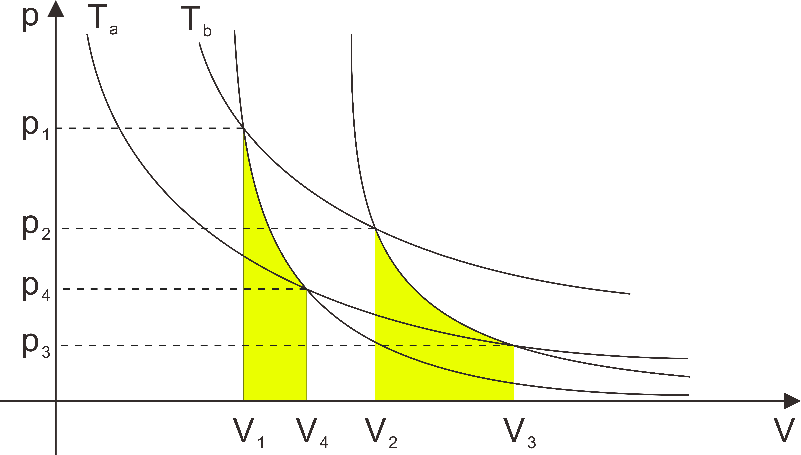

如图所示为卡诺循环，其中12和34是等温过程，23和41为绝热过程

在等温过程中
$$
T_1 = T_2 = T_a\\
T_3 = T_4 = T_b
$$

在绝热过程中
$$
\Delta E + W = 0
$$
即
$$
W = -\Delta E
$$

对于过程23的情况
$$
W_{23} = - \Delta E_{23}= - \mu C_{V,m} (T_a-T_b)
$$
对于过程41的情况
$$
W_{41} = - \Delta E_{41}= - \mu C_{V,m} (T_b-T_a)
$$
因此
$$
|W_{23}|=|W_{41}|
$$
