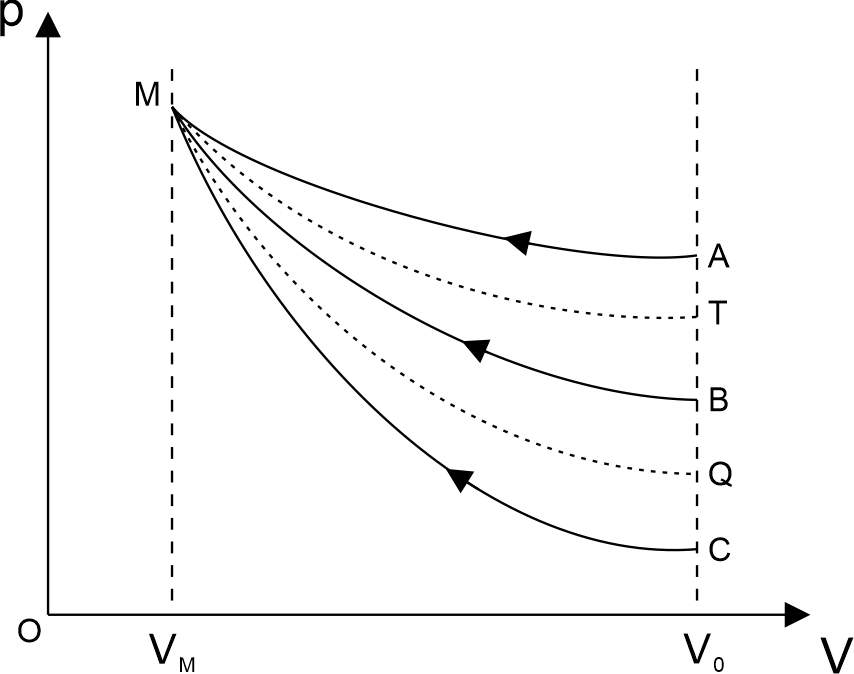
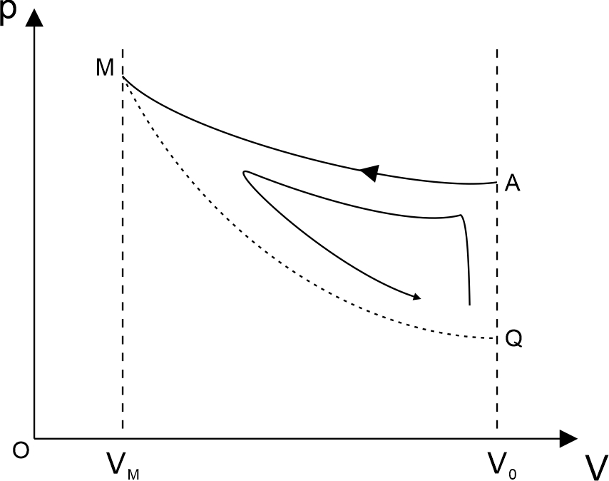
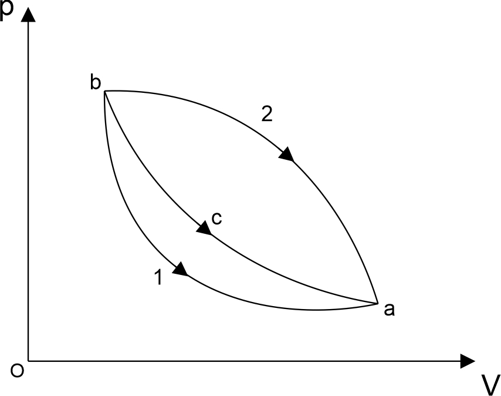
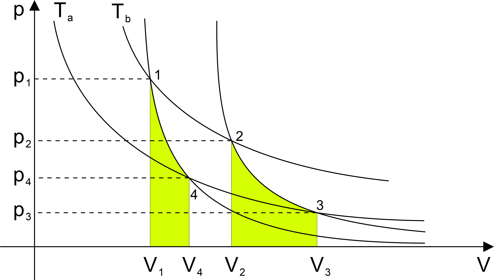
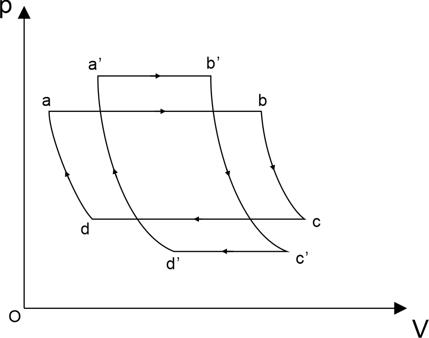
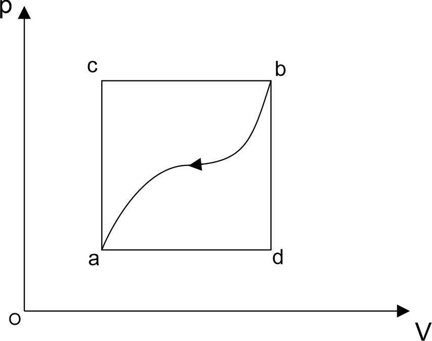
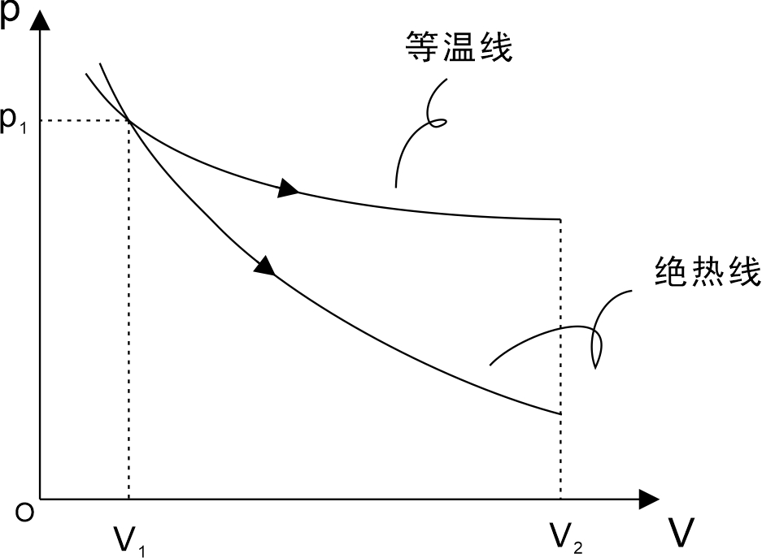
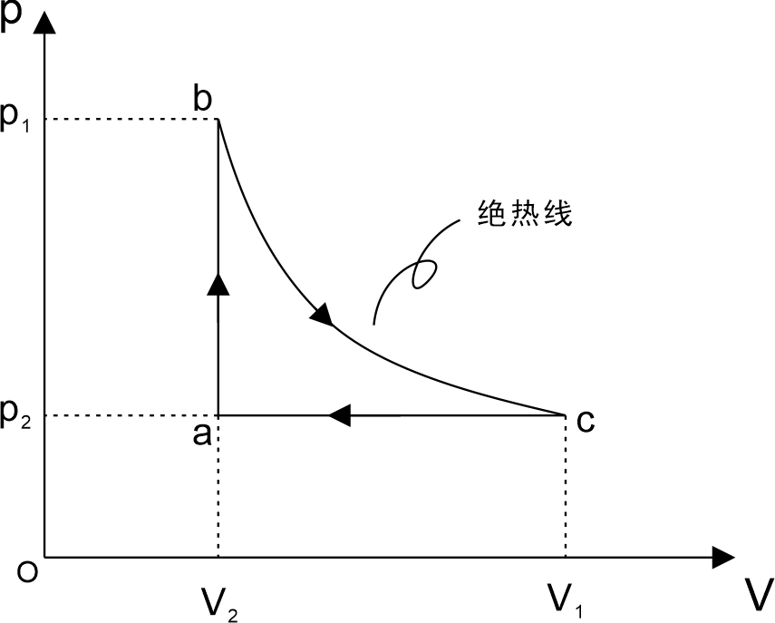
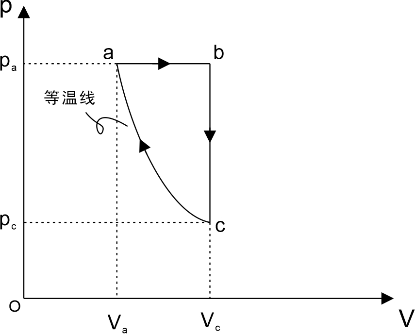
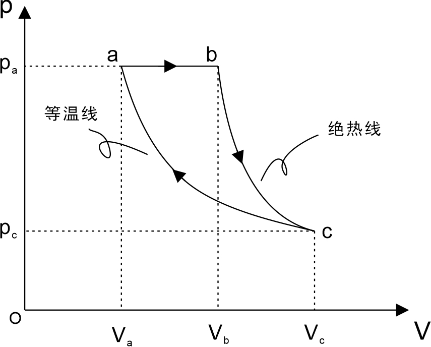

# 热力学例题解析

## 填空题

### 例题1

​		已知 $1\,\mathrm{mol}$ 的某种理想气体（其分子可视为刚性分子），在等压过程中温度上升 $1\,\mathrm K$ ，内能增加了 $20.78\,\mathrm J$ ，则气体对外做功为 \_\_\_\_\_\_\_\_ ，气体吸收热量为 \_\_\_\_\_\_\_\_ 。

解：

​		理想气体的内能是温度的单值函数
$$
\Delta E = \mu C_{V,m} \Delta T = 20.78\,\mathrm J
$$
​		在等压膨胀过程中，系统吸收的热量为
$$
Q = \mu C_{p,m}\Delta T=\mu (C_{V,m}+R) \Delta T =\Delta E +\mu R \Delta T
$$
​		根据热力学第一定律
$$
Q = \Delta E +W
$$
​		气体对外做功大小为
$$
W = Q-\Delta E = \mu R \Delta T \approx 8.31\,\mathrm J
$$
​		故气体吸收热量为
$$
\Delta E + W \approx 29.09\,\mathrm J
$$

### 例题2

​		如图所示为一理想气体几种状态变化过程的 $p-V$ 图，其中 $MT$ 为等温线， $MQ$ 为绝热线，在 $AM$ 、 $BM$ 、 $CM$ 三种准静态过程中：温度升高的是 \_\_\_\_\_\_\_\_ 和 \_\_\_\_\_\_\_\_ 过程，其中气体吸热的是 \_\_\_\_\_\_\_\_ 过程。

解：

​		考虑温度的时候，以等温线 $TM$ 为参照。

​		当理想气体 $V = V_0$ 时，根据物态方程
$$
pV=\mu RT
$$
​		可知此时压强与温度成正比，此时
$$
T_A>T_T>T_B>T_C
$$
​		而在 M 点处，所有曲线上的温度与等温线上的温度相等，因此在气体体积从 $V_0$ 过渡到 $V_M$ 的过程中，曲线 $AM$ 上的温度是下降的，曲线 $BM$ 和 $CM$ 上的温度是上升的。

​		考虑系统吸放热的时候，以绝热线 $QM$ 为参照。

​		这里仅对 $AM$ 曲线的吸放热状况做详细的解读

​		

​		首先构造如图所示的逆循环 $QAMQ$ ，设它的净功为 $W$ ，则
$$
W = Q_{QA}+Q_{AM}+Q_{MQ} < 0
$$
​		（特意选择和AM方向一致的循环，方便理解）

​		其中绝热线上没有热量变化，$Q_{MQ} = 0$ ，而 $Q_{QA} > 0$ 

​		(内能增量与温度成正比，等体过程中温度和气压成正比)

​		因此必有 $Q_{AM} < 0$ ，该曲线是**放热过程**

​		类似的，对于 $Q_{CM}$ 可以建立正循环进行分析，最终可以的到 $Q_{CM} > 0$ ，因此该过程为**吸热过程** 。

### 例题3

​		有一卡诺热机，用 $290\,\mathrm g$ 空气为工作物质（空气的摩尔质量为 $29\times 10^{-5} \,\mathrm {kg/mol}$ ），工作在 $27\,^\circ\mathrm C$ 的高温热源与 $-73\,^\circ\mathrm C$ 的低温热源之间，此热机的效率 $\eta$ = \_\_\_\_\_\_\_\_ 。

解：

​		理想的卡诺热机效率仅与高温热源和低温热源的温度有关
$$
\eta = 1-\frac{T_2}{T_1} = 1-\frac{200\,\mathrm K}{300\,\mathrm K} \approx 33.3\%
$$
​		（注意此处的温度是热力学温度，而非摄氏温度）

### 例题4

​		$2\,\mathrm {mol}$ 单原子分子理想气体，从平衡态 1 经一等体过程后达到平衡态 2，温度从 $200\,\mathrm K$ 上升到 $500\,\mathrm K$ ，若该过程为准静态过程，气体吸收的热量为 \_\_\_\_\_\_\_\_  。

 

解：

​		等体过程不做功
$$
Q = \Delta E = \mu C_{V,m}\Delta T=\mu \frac i 2R \Delta T = 7479\,\mathrm J 
$$
​		(式中自由度 $i$ 取3，因为单原子分子有三个位移方向上的自由度)

### 例题5

​		设热源的热力学温度是冷源的热力学温度的 $n$ 倍，则在一个卡诺循环过程中，气体将把从热源得到的热量 $Q_1$ 中的 \_\_\_\_\_\_\_\_ 传递给冷源。

解：

​		该热机效率为
$$
\eta = 1-\frac{T_2}{T_1}=1-\frac{T_2}{nT_{2}}=1-\frac{1}{n}
$$
​		剩下的热量 $Q_2$ 传递给冷源，而 $W=Q_1+Q_2$  (这里是代数和，$Q$ 可正可负)
$$
\eta = \frac{W}{Q_1}=1+\frac{Q_2}{Q_1}
$$
​		得到
$$
\frac{Q_2}{Q_1} = 1-\eta = \frac1n
$$

$$
Q_2 = \frac1n Q_1
$$

​		即气体把从热源得到的热量 $Q_1$ 中的 $\frac1n$ 传递给冷源。

## 选择题

### 例题1

​		如图所示，bca为理想气体绝热过程，b1a 和 b2a 是任意过程，则上述两过程中气体做功与吸收热量的情况是？

解：

​		首先两个过程气体都是对外做功，因为沿箭头方向是正方向

​		（从左到右，积分上限大于下限，同时被积函数 $p$ 恒大于0 ）

​		但是吸热放热不好判断，这里可以通过热力学第一定律来理解
$$
Q=\Delta E +W
$$
​		该题主要区分**状态量**和**过程量**的概念

​		$\Delta E$ 是一个状态量，它的大小只取决于初末温度，与路径无关

​		$W$ 是一个过程量，它的大小和路径有关

​		$Q$ 为前两者的和，因此也是一个过程量，其大小与路径有关

​		假设从 b 到 a (无论经过哪条路径)，系统内能的变化为 $\Delta E$ 

​		先考虑 bca 的情况
$$
Q_{bca} = \Delta E + W_{bca} = 0
$$
​		因此
$$
\Delta E = -W_{bca}
$$
​		如此一来，判断吸放热的问题可以转换为面积大小的比较问题

​		例如考虑 b1a 过程
$$
Q_{b1a} = \Delta E + W_{b1a} = (-W_{bca})+W_{b1a} < 0
$$
​		考虑 b2a 过程
$$
Q_{b2a} = \Delta E + W_{b2a} = (-W_{bca})+W_{b2a} > 0
$$
​		因此 b1a 过程放热，而 b2a 过程吸热。

### 例题2

​		对于室温下的刚性双原子分子气体为具有一定的摩尔定容热容 $C_{V,m}$ 的理想气体，在等压膨胀的情况下，系统对外做功与从外界吸收的热量之比 $W/Q$ 等于？

解：

​		等压膨胀过程中
$$
\frac{W}{Q} = \frac{\mu R \Delta T}{\mu C_{p,m}\Delta T} =\frac{R}{C_{V,m}+R} = \frac{R}{\frac i2 R +R} = \frac 2{i+2} =\frac27
$$
​		（刚性双原子分子 $i$ 取5，三个方向位移自由度，两个方向旋转自由度）

### 例题3

​		理想气体卡诺循环过程的两条绝热线下的面积大小（如图阴影部分）分别为 $S_1$ 和 $S_2$ ，则二者的大小关系是？

答：相等

解析：

​		如图所示为卡诺循环，其中12和34是等温过程，23和41为绝热过程

​		在等温过程中
$$
T_1 = T_2 = T_b\\
T_3 = T_4 = T_a
$$

​		在绝热过程中
$$
\Delta E + W = 0
$$
​		即
$$
W = -\Delta E
$$

​		对于过程23的情况
$$
W_{23} = - \Delta E_{23}= - \mu C_{V,m} (T_a-T_b)
$$
​		对于过程41的情况
$$
W_{41} = - \Delta E_{41}= - \mu C_{V,m} (T_b-T_a)
$$
​		因此
$$
|W_{23}|=|W_{41}|
$$

### 例题4

​		“理想气体和单一热源接触做等温膨胀时，吸收的热量全部用来对外做功。” 对此说法有如下几评论，哪种是正确的？试辨析

		1. 不违反热力学第一定律，但违反热力学第二定律
  		2. 不违反热力学第二定律，但违反热力学第一定律
                		3. 不违反热力学第一定律，也不违反热力学第二定律
            		4. 违反热力学第一定律，也违反热力学第二定律

解：

​		热力学第一定律，即
$$
Q=\Delta E +W
$$
​		等温膨胀过程温度不变，所以系统内能增量为零，吸收的热量全部用来对外做功，因此不违反热力学第二定律。

​		热力学第二定律的描述为

​		“不可能制成一种循环动作的热机，只从单一热源吸取热量，使之全部变成有用的功，而不引起其它变化。”

​		虽然理想的卡诺循环从单一热源吸取热量，使之全部变成有用的功，但是引起了体积变化，因此并不违背热力学第二定律。

### 例题5

​		某理想气体分别进行了如图所示两个卡诺循环 $I(a'b'c'd'a')$ 和 $II (abcda)$ ，且两个想你换曲线所围面积相等。设循环 $I$ 的效率为 $\eta$ ，每次循环在高温热源处吸收的热量为 $Q$ ，循环 $II$ 的效率为 $\eta'$ ，每次在高温热源处吸收的热量为 $Q'$ ，则？

​		A. $\eta <\eta'$ , $Q<Q'$ 

​		B. $\eta >\eta'$ , $Q>Q'$ 

​		C. $\eta <\eta'$ , $Q > Q'$ 

​		D. $\eta > \eta'$ , $Q<Q'$ 

解：

​		对于理想的卡诺热机，其热机效率仅仅与高温、低温热源温度相关，即
$$
\eta = 1-\frac{T_{低温}}{T_{高温}}
$$
​		温度差越大的，热机效率越高。

​		因此
$$
\eta ' > \eta
$$
​		又有
$$
\frac{W'}{Q'}=\eta'>\eta =\frac{W}{Q}
$$
​		由于曲线所围成的面积相等，因此两种循环做的净功相等，即
$$
W = W'
$$
​		因此
$$
Q>Q'
$$

## 计算题

### 例题1

​		理想气体由初状态 ($p_1,V_1$) 经绝热膨胀至末状态 ($p_2,V_2$) 。试证：此过程中气体所做的功为
$$
A = \frac{p_1V_1-p_2V_2}{\gamma-1} 
$$
​		式中 $\gamma$ 为气体的热容比。

证：

​		先由迈耶公式与热容比的定义
$$
\left\{
\begin{align}
&C_{p,m} = C_{V,m} + R\\
&\gamma = C_{p,m}/C_{V,m}
\end{align}
\right.
$$
​		因此可以用热容比 $\gamma$ 来表示摩尔定体热容 $C_{V,m}$ 如下
$$
C_{V,m} = \frac{R}{\gamma - 1}
$$
​		绝热过程中，系统与外界不交换热量
$$
Q = \Delta E + W = 0
$$
​		因此
$$
W = -\Delta E = -\mu C_{V,m}\Delta T = \frac{-\mu R \Delta T}{\gamma - 1}
$$
​		其中 $\Delta T = T_2 - T_1$ 为末状态与初状态的温度差，用理想气体的状态方程进行化简
$$
W = \frac{-\mu R (T_2 - T_1)}{\gamma - 1}=\frac{\mu R T_1-\mu R T_2}{\gamma -1} = \frac{p_1V_1-p_2V_2}{\gamma - 1}
$$
​		证毕

### 例题2

​		一系统由状态 a 沿 acb 到达状态 b 的过程中，有 $350\,\mathrm J$ 的热量传入系统，而系统做功 $126\,\mathrm J$ 。

(1). 若沿 adb 时，系统做功 $42\,\mathrm J$ ，问有多少热量传入系统？

(2). 若系统由状态 b 沿曲线 ba 返回状态 a 时，外界对系统做功为 $84\,\mathrm J$ ，试问系统是吸热还是放热？热量传递是多少？

​		

​		本题重点在于对热力学第一定律的运用，细节在于对表达式中各个量的符号辨析。

解：

​		根据热力学第一定律
$$
Q=\Delta E + W
$$
​		从状态 a 出发沿 acb 到达状态 b 的过程中
$$
350\,\mathrm J = \Delta E +126\,\mathrm J
$$
​		因此该过程系统内能的增量为
$$
\Delta E = 224\,\mathrm J
$$
​		1、沿着 adb 系统做功，此时传入系统的热量为
$$
Q_{adb} = \Delta E + 42\,\mathrm J =  266\,\mathrm J
$$
​		2、系统由状态 b 沿曲线 ba 返回状态 a 的过程，系统对外做功，此时传入系统的热量
$$
Q_{ba} = (-\Delta E) + (-84\,\mathrm J) = -308\,\mathrm J
$$
​	（内能的增量只和初末温度有关，与路径无关，但有正负之分）

​	（从 a 到 b 是温度上升的过程，而从 b 回到 a 是温度下降的过程）

​	（表达式中的 $W$ 是系统对外做功，这里规定了一个参考方向，因此外界对系统做功时 $W<0$ ）

### 例题3

​		如果一定量的理想气体，其体积和压强依照 $V = a/\sqrt p$ 的规律变化，其中 $a$ 为已知常量，试求：

(1). 气体从体积 $V_1$ 膨胀到 $V_2$ 所做的功

(2). 气体体积为 $V_1$ 时的温度 $T_1$ 与体积为 $V_2$ 时的温度 $T_2$ 之比

解：

​		1、由题意可知
$$
p=\left(\frac aV \right)^2
$$
​		由气体做功的积分表达式可得
$$
W = \int^{V_2}_{V_1}\left(\frac aV \right)^2\,dV = a^2(\frac1{V_1}-\frac1{V_2})
$$
​		2、由题中体积压强的变化关系，可得
$$
\begin{align}
&V_1 = a/\sqrt{p_1}\\
&V_2 = a/\sqrt{p_2}
\end{align}
$$
​		两式相除，并带入理想气体的物态方程
$$
\frac{p_1}{p_2} = \left(\frac{V_2}{V_1}\right)^2 = \frac{\mu R T_1 / V_1}{\mu R T_2 / V_2} = \frac{T_1V_2}{T_2V_1}
$$
​		因此
$$
\frac{T_1}{T_2} = \frac{V_2}{V_1}
$$

### 例题4

​	如图所示，体积为 $V_1 = 1\,\mathrm L$ 的双原子分子理想气体，压强 $p_1=1.013 \times 10^5 \,\mathrm{Pa}$ ，使之在下述条件下膨胀到 $V_2=2\,\mathrm L$ 。

(1). 等温膨胀

(2). 绝热膨胀

并分别计算两种情况下气体吸收的热量，所做的功及内能的变化。

解：

​		1、等温过程中系统内能保持不变
$$
Q = W = \mu R T\ln\left(\frac{V_2}{V_1}\right) = p_1V_1\ln\left(\frac{V_2}{V_1}\right) \approx 70.2\,\mathrm J
$$

$$
\Delta E =0
$$

​		2、绝热过程中，气体初末状态的压强和体积满足
$$
p_1V_1^\gamma = p_2V_2^\gamma
$$
​		即
$$
p_2 = p_1\left(\frac{V_1}{V_2}\right)^\gamma
$$
​		此时
$$
Q = -W = -\frac{p_1V_1-\left[p_1\left(\frac{V_1}{V_2}\right)^\gamma\right]V_2}{\gamma -1} \approx - 61.3\,\mathrm J
$$
​		（双原子分子，取自由度 $i=5$ ，因此 $\gamma = 1.4$ ）

### 例题5

​		设有一个以理想气体为工质的热机循环，过程如图所示，试证其循环效率为
$$
\eta = 1-\gamma\frac{\frac{V_1}{V_2}-1}{\frac{p_1}{p_2}-1}
$$

解：

​		经分析，ab 是等体增压过程，该过程系统吸热；ca 是等压收缩过程，该过程系统放热。

​		热机效率为
$$
\eta = \frac{W}{Q_{ab}} = \frac{Q_{ab}+Q_{bc}+Q_{ca}}{Q_{ab}} = 1+\frac{Q_{ca}}{Q_{ab}}
$$
​		其中，对于等压过程 ca ，传入系统的热量满足
$$
Q_{ca} = \mu C_{p,m}(T_a-T_c)=\frac{i+2}2 \mu R (T_a - T_c) = \frac{i+2}2 p_2(V_2-V_1)
$$
​		同理，对于等体过程 ab ，传入系统的热量满足
$$
Q_{ab} = \mu C_{V,m}(T_b-T_a)=\frac i2 \mu R (T_b - T_a) = \frac i2 V_2(p_1-p_2)
$$
​		因此
$$
\begin{align}
\eta &= 1+\frac{\frac{i+2}2 p_2(V_2-V_1)}{\frac i2 V_2(p_1-p_2)}\\[3mm]
&=1+\gamma \frac{p_2V_2-p_2V_1}{p_1V_2-p_2V_2}\\[3mm]
&=1-\gamma\frac{p_2V_1-p_2V_2}{p_1V_2-p_2V_2}\\[3mm]
&=1-\gamma\frac{\frac{V_1}{V_2}-1}{\frac{p_1}{p_2}-1}

\end{align}
$$
​		证毕

### 例题6

​		$1\,\mathrm{mol}$ 双原子分子理想气体，原来压强为 $2.026\times 10^5\,\mathrm{Pa}$ ，体积为 $20\,\mathrm L$ ，首先等压地膨胀到原体积的 $2$ 倍，然后等容冷却到原温度，最后等温压缩到初状态，

(1). 做出循环的 $p-V$ 图

(2). 求工作物质在各过程中所做的功

(3). 计算循环的效率

解：

​		1、 $p-V$ 图如下

​		

​		2、三个过程做功情况如下
$$
\begin{align}
&W_{ab} = p_a(V_c-V_a) = 4052\,\mathrm J\\[3mm]
&W_{bc} = 0\\
&W_{ca} = p_a V_a \ln\left(\frac{V_a}{V_c}\right) \approx -2808\,\mathrm J
\end{align}
$$
​		3、由第2小问可求得该循环输出的净功为
$$
W = W_{ab}+W_{bc}+W_{ca} = 1244\,\mathrm J
$$
​		经分析可知吸热的过程为 ab 过程，该过程中传入系统的热量为
$$
Q_{ab} = \mu C_{p,m}(T_b-T_a) = \frac{i+2}2 \mu R (T_b-T_a) = \frac{i+2}2 p_a(V_c-V_a) = 14182\,\mathrm J
$$
​		可求得热机效率为
$$
\eta = \frac W {Q_{ab}} \approx 8.77\%
$$
​		（对于双原子分子，自由度 $i=5 $ ）

### 例题7

​		$1\,\mathrm{mol}$ 双原子分子气体，原来的温度为 $300\,\mathrm K$ ，体积为 $4\,\mathrm L$ ，首先等压膨胀到 $6.3\,\mathrm L$ ，然后绝热膨胀回原来的温度，最后等温压缩回原状态。试在 $p-V$ 图上表示此循环，并计算循环的效率。

解：

​		$p-V$ 图如下

​		经分析， ab 过程等压膨胀，系统吸热；ca 过程等温收缩，系统放热；bc 过程绝热膨胀，系统不与外界交换热量。

​		在 ab 的等压膨胀过程中，气体的温度与体积成正比
$$
\frac{T_b}{T_a} = \frac{V_b}{V_a}
$$
​		因此
$$
T_b = \frac{V_b}{V_a} T_a
$$
​		在 bc 的绝热过程中，气体的温度和体积的关系为
$$
T_b V_b^{\gamma-1} = T_cV_c^{\gamma-1}
$$
​		因此
$$
V_c = \left(\frac{T_b}{T_c}\right)^{\frac1{\gamma-1}} V_b
$$
​		又因为 $T_c = T_a $ ，所以有
$$
V_c = \left(\frac{V_b}{V_a}\right)^{\frac1{\gamma-1}} V_b
$$
​		所以热力效率
$$
\begin{align}
\eta &= \frac{Q_{ab}+Q_{bc}+Q_{ca}}{Q_{ab}} \\[2mm]
&= 1+\frac{Q_{ca}}{Q_{ab}}\\[2mm]
&=1+\frac{\mu R T_a\ln\left(\frac{V_a}{V_c}\right)}{\mu C_{p,m}(T_b-T_a)} \\[3mm]
&= 1+\frac{T_a\ln\left(\frac{V_a}{V_c}\right)}{\frac{i+2}2(T_b-T_a)}\\[2mm]
&=1+\frac{T_a\ln\left(\frac{V_a}{V_b}\right)^{\frac{\gamma}{\gamma-1}}}{\frac{i+2}2(\frac{V_b}{V_a}-1)T_a}\\[2mm]
&=1+\frac{\ln\left(\frac{V_a}{V_b}\right)^{\frac{\gamma}{\gamma-1}}}{\frac{i+2}2(\frac{V_b}{V_a}-1)}\\[2mm]
&=1+\frac{-1.59}{\quad 2.01}\\[2mm]
&\approx 21\%
\end{align}
$$

