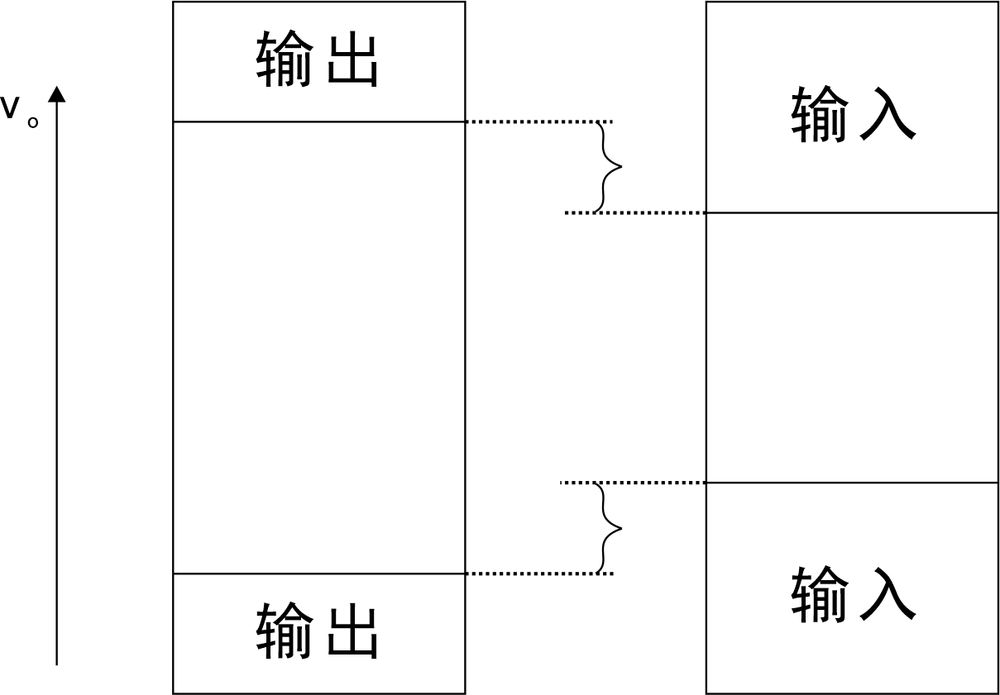

# 进制转换

## n进制转十进制

按权展开

## 十进制转n进制

### 整数部分

除以n倒序取余

### 小数部分

乘以n正序取余

#### 舍位规范

零舍一入（二进制）

三舍四入（八进制）

七舍八入（十六进制）

# 逻辑运算

## 基本逻辑运算

1. 与运算
2. 或运算
3. 非运算

## 复合逻辑运算

1. 与非
2. 或非
3. 异或
4. 同或

## 逻辑符号

## 逻辑真值表

## 逻辑表达式

# 逻辑函数表达式的形式

1. 与-或表达式
2. 或-与表达式
3. 最小项表达式
4. *最大项表达式

## 最小项表达式（标准与-或表达式）
1. 任意一个最小项，输入变量只有一组取值使其值为1，而其他各组取值均使其为0。并且最小项不同，使其值为1的输入变量取值也不同。
2. 任意两个不同的最小项只积为0。
3. 所有最小项之和为1。

# 复杂逻辑函数化简

## 公式法

### 一般代数运算律

1. 交换律
2. 结合律
3. *分配律

（分配律还包括 $A+BC = (A+B)(A+C)$ ，这个逻辑代数特有的运算律十分重要）

### 逻辑代数补充运算律

1. 零一律
2. 重叠律
3. 互补律
4. 吸收律
5. 反演律

## 卡诺图法

### 卡诺图化简步骤

1. 将逻辑函数写成最小项表达式
2. 填卡诺图
3. 找出为1的相邻最小项画圈，每次包围 $2^n$ 个方格，写出每个圈乘积项
4. 将所有乘积项相加

### 卡诺图画圈规则

1. 包围圈内的方格必定是 $2^n$ 个
2. 相邻方格包括上下底相邻，左右边相邻，四个角相邻
3. 同一方格可以被不同的包围圈重复包围，但新增包围圈种一定要有新的方格，否则多余
4. 包围圈内方格要尽可能多，包围圈的数目要尽可能少

（包围圈越大，乘积项变量越少，包围圈越少，乘积项个数越少）

​		经观察， $n$ 个逻辑变量有 $2^n$ 个最小项，若圈出一个 $2^r$ 大小的包围圈，乘积项变量有 $n-r$ 个，圈出 $k$ 个包围圈，最小项就有 $k$ 个。

## 带无关项的化简

# CMOS逻辑门

## NMOS

高电平导通（一般源极接地）

## PMOS

低电平导通（一般源极接电源）

## 通过电路判断逻辑功能

将MOS管作为开关用，漏源之间的开关

其逻辑功能主要通过开关的串并联关系得到，例如

开关串联——逻辑与

开关并联——逻辑或

最终是要判断输出端与 $\mathrm{V_{DD}}$ 接通还是与 $\mathrm{GND}$ 接通

## 传输门（TG门）

理解什么是**高阻态** 

理解TG门导通的条件

## 漏极开路门

了解漏极开路门的**逻辑符号** 

理解**线与** （以前出过填空题）

## 三态门

理解**高阻态** 

三态门由传输门构成

## 噪声容限

输出电平范围必然落在输入电平范围内

## 时延功耗积

## 扇入扇出数

# 组合逻辑电路的分析和设计

