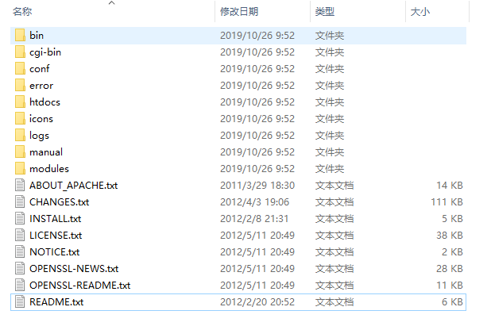
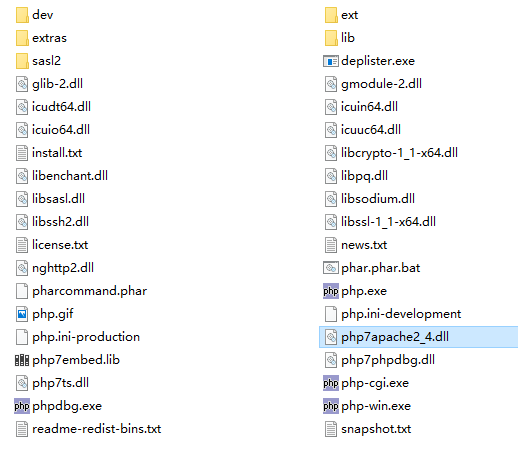

# Apache-PHP环境配置

本攻略参考自B站上**《28天PHP零基础入门到精通教程》**，并由我亲身实践整理出来

## 下载Apache安装包

一般命名为

httpd-X.X.XX-win32-x86-no_ssi.msi

> 我在我的计算机上将它们安装在 "D:\myfile\software\ApacheServer" 下，简称 home\ 目录
>
> 将Apache装在 "D:\myfile\software\ApacheServer\Server" 下，简称 Server\ 目录
>
> 将PHP装在 "D:\myfile\software\ApacheServer\PHP7" 下，简称 PHP\ 目录

下载链接：[ApacheX64 Download](https://www.apachehaus.com/cgi-bin/download.plx?dli=khkQz5UeNVTT6h2KTVVMNBlVOpkVFVFdUBDZwMWQ)


## 安装配置Apache

选择安装在 Server\ 目录下



在该目录下

> * bin\ 和 cgi-bin\ 里面存放可执行文件，例如httpd.exe，将 bin\ 目录加入path环境变量
>* conf\ 中存放配置文件，其中 httpd.conf 是总配置文件，conf\extra\ 文件夹下是子配置文件，每次修改配置需要用`httpd -k restart`重启服务器
> * modules\ 中存放各种功能模块，主要在 conf\httpd.conf 中进行灵活的配置
>* htdocs\ 下存放进入网站的主页，最开始这里有一个html文件，打开是 "It works!" 页面

进入 conf\ 下，编辑 httpd.conf ，将里面的 "ServerName	localhost:80" 前的注释#去掉，而后`httpd -k restart`重启

在cmd中输入 httpd -t 可以测试配置是否可行，有无语法错误，若没有，则会输出 "syntax ok"

此时可以在浏览器中输入 "localhost" 会显示 "It works!" 页面，表示运行Apache运行正常


## 下载PHP包

寻找一个版本的php，一般有很多版本，对应不同的环境有不同形式的安装包，比如.tar.gz，还有一种已经编译好的Windows平台解释器，解压出来就可以使用，因此选择那个版本的php

但要特别注意该包下必须有 "php7apache2_4.dll" 这个动态链接库，这是之后要在 \conf\httpd.conf 上配置的。

> 之所以这么说是因为我最开始装的那个正好没有 "php7apache2_4.dll" 文件，因而导致了一系列的问题。

下载链接：[PHP7.3 Download ZIP](https://windows.php.net/downloads/releases/php-7.3.11-Win32-VC15-x86.zip)


## 安装配置PHP

打开压缩包把它解压至 PHP7\ 目录下



> ext\ 下存放扩展包，PHP中很多功能都是用过加载扩展来实现
>
> php.exe 这个是PHP的解释器，将当前目录加入 path 环境变量就可以作为命令使用，和python一样
>
> php7apache2_4.dll 这个是Apache支持包
>
> php.ini-development 和 php.ini-production 是PHP的配置文件，前者是“开发版”，后者是“生产版”，需要的时候把ini后面的字符去掉

暂不使用PHP的配置文件，采用默认配置


## 配置Apache加载PHP模块

这部分就是要在Apache中配置 "php7apache2_4.dll" 文件，使得Apache可以加载php页面

配置过程如下

进入 Server\conf\ 编辑 httpd.conf 文件

在适当位置添加

```ini
LoadModule php7_module 'D:/myfile/software/ApacheServer/PHP7/php7apache2_4.dll'
```

而后使用`httpd -t`来测试，同样显示 "syntax ok" 表示成功

但是这个时候仍然无法在服务器上运行php文件

还需要一步，将.php后缀的文件分配给php解释器运行

继续在 Server\conf\httpd.conf 上进行编辑，加入

```ini
AddType application/x-httpd-php .php
```

而后重启 Apache

在cmd输入`httpd -t`进行测试


## 阶段测试

在 Server\htdocs\ 下创建 test.php ，内容如下：

```php
<?php
    echo 'Hello World!'
?>
```

在浏览器中输入

```url
localhost\test.php
```

此时会显示 "Hello World!" 页面，说明环境已经配置好了


## 将PHP配置文件加载到Apache配置文件中

虽然目前已经能让Apache调用php解释器处理.php文件了，但还是存在一些问题

就像在linux系统下，可以切换用户登陆，但每一个用户都有个人定制的环境配置，以及一些权限属性之类的

现在Apache和PHP是在共同运行的，它们之间需要一定程度地共享配置信息

具体分为两个部分

1. 在Apache中指定PHP配置文件所在路径

   在 Server\conf\httpd.conf 中加入

   ```ini
   PHPIniDir 'D:/myfile/software/ApacheServer/PHP7'
   ```

2. 修改PHP的配置文件名，使之生效

   在 PHP7\ 将 "php.ini-development" 复制一份并重命名为 "php.ini"

操作完成，重启Apache

> ★★★以后php.ini的修改需要Apache重启才会生效！！！！

