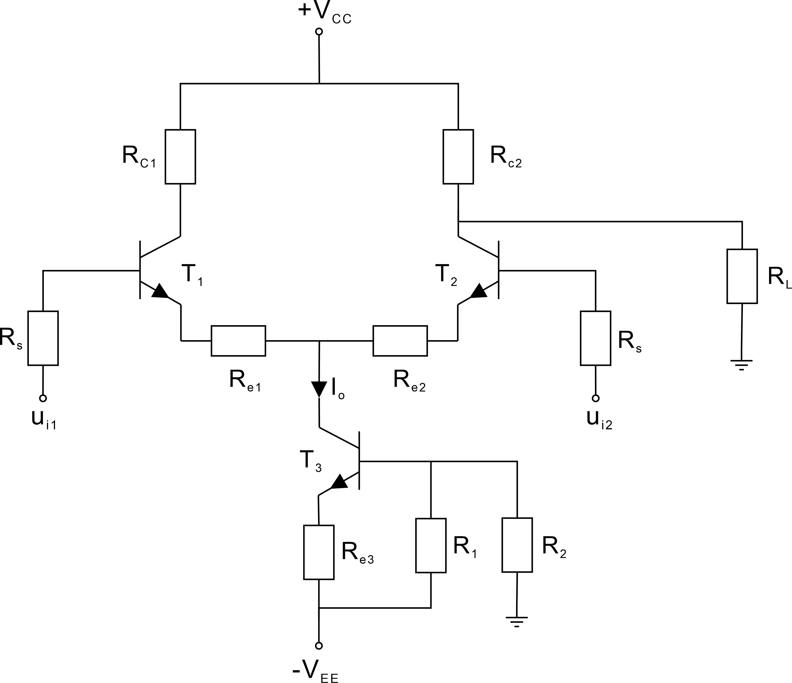
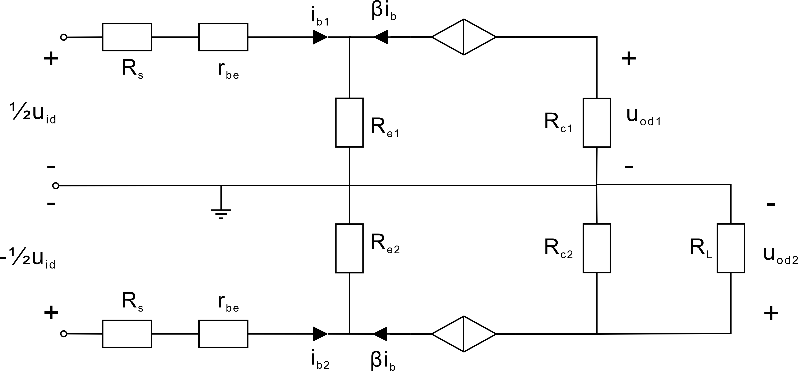
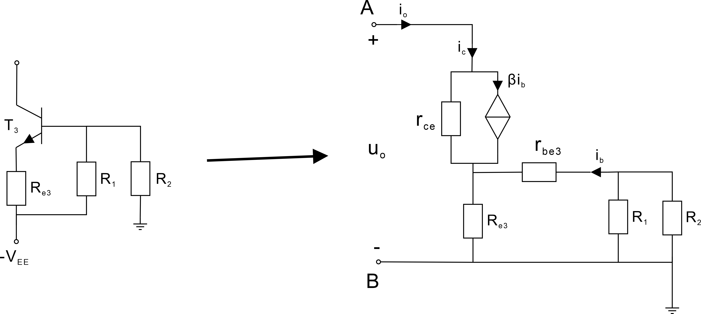
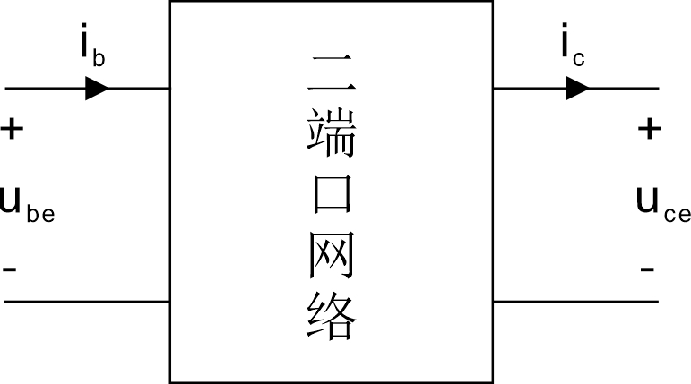
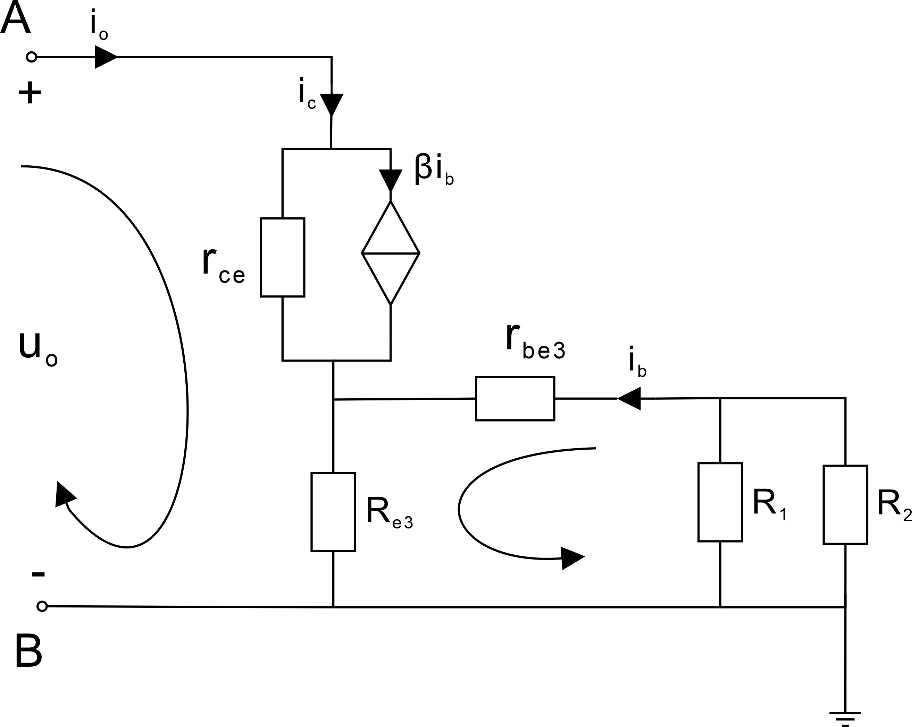
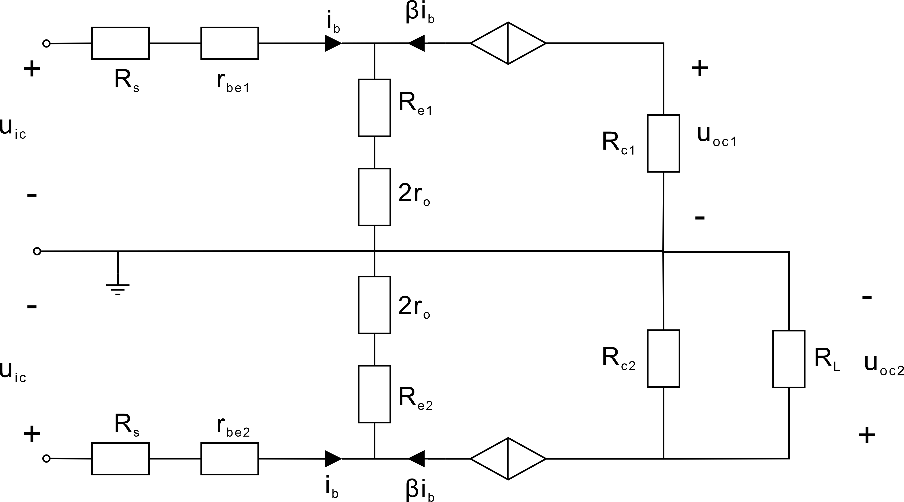
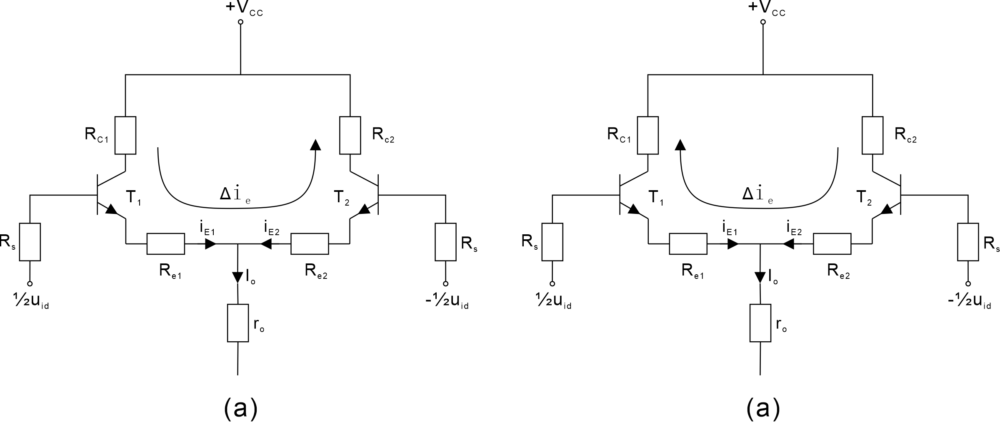
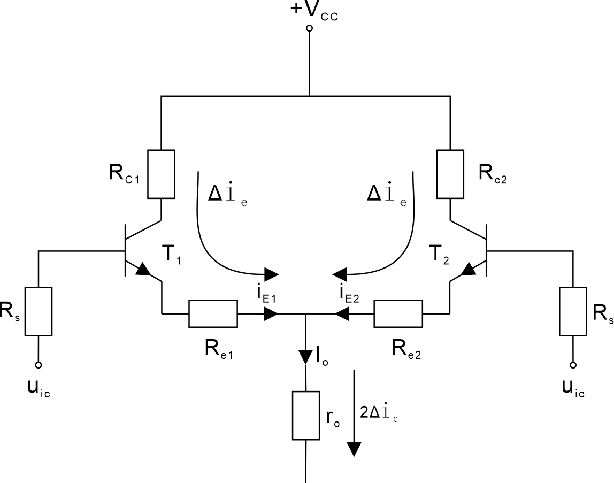

# 差分放大电路例题解析

​		电路如下图所示，已知BJT的 $\beta_1=\beta_2=\beta_3=50$ , $r_{ce}=200\ k\Omega$ , $V_{BE}=0.7\,\mathrm V$ , 试求单端输出的差模电压增益 $A_{vd2}$ , 共模抑制比 $K_{CMR2}$ , 差模输入电阻 $R_{id}$ 和输出电阻 $R_o$.

 

​		原图标注条件： $R_{c1}=R_{c2}=4.7\,k\Omega$ , $R_{e1}=R_{e2}=R_{s}=100\,\Omega$ , $R_1 = 5.6\,k\Omega$ , $R_2=3\,k\Omega$ , $R_{e3}=1.2\,k\Omega$ , $R_L=10\,k\Omega$ , $V_{CC}=V_{EE}=9\,\mathrm V$.

## 静态分析

​		静态情况下 , 输入信号 $u_{i1}=u_{i2}=0$ .

​		图中 , $T_3\ R_{e3}\ R_1\ R_2$ 构成电流源电路 , 即一个内阻很大得以输出稳定电流的电路 .

补充：电流源之所以为电流源，最根本的特点是其内阻远大于外电路的等效电阻，以至于任何外电路接入该电流源，都将获得基本不变的电流 , 与电压源相对。

​		对该电流源电路进行单独分析

​		其中 $I_{B3}\ll I_{C3},I_{E3}$ , $V_{BQ}$ 为 $-V_{EE}$ 在 $R_1$ 与 $R_2$ 上的分压
$$
V_{BQ}\approx \frac{R_2}{R_1+R_2} (0-(-V_{EE}))
$$
​		我们取 $T_3$ 管工作在正常放大状态时 $U_{BEQ}$ 的经验值 $0.7\,\mathrm V$ 
$$
V_{EQ} = V_{BQ}-V_{BEQ}\approx V_{BQ}-0.7\,\mathrm V
$$
​		然后可以求出该电流源的电流
$$
I_o\approx I_{EQ}=\frac{V_{EQ}}{R_{e3}}\approx 2\,\mathrm{mA}
$$

​		由于 $T_1$ 与 $T_2$ 参数完全一致 , 故
$$
I_{EQ1}=I_{EQ2} = \frac12 I_o = 1\,\mathrm{mA}
$$
​		这时三极管基极动态电阻 $r_{be}$ 就可以确定了

$$
r_{be1} = r_{be2}\approx 200\,\mathrm\Omega + (1+\beta)\frac{26\,\mathrm{mV}}{ I_{EQ}}\approx 1.5 \,k\Omega
$$
$$
r_{be3} \approx 200\,\Omega + (1+\beta)\frac{26\,\mathrm{mV}}{I_o}\approx 0.86\,k\Omega
$$

​		到这一步，静态分析基本完成

## 动态分析

### 差模分析

​		

​		如上图所示电路为差模情况下的小信号等效电路 .

​		对于2端的差模增益，有
$$
\begin{align}
&A_{vd2} = \frac{v_{od2}}{v_{id}}\\[2mm]
&=\frac{v_{od2}}{\frac12v_{id}-(-\frac12 v_{id})}\\[2mm]
&=\frac{-\beta i_{b2}(R_{c2}\parallel R_L)}{(R_s+r_{be1}+(1+\beta)R_{e1})i_{b1}-(R_s+r_{be2}+(1+\beta)R_{e2})i_{b2}}\\[3mm]
&\qquad其中 r_{be1}=r_{be2} , R_{e1} = R_{e2} , i_{b2}=-i_{b1}\\[3mm]
&=\frac{\beta i_{b1}(R_{c2}\parallel R_L)}{2(R_s+r_{be1}+(1+\beta)R_{e1})i_{b1}}\\[2mm]
&=\frac{\beta (R_{c2}\parallel R_L)}{2(R_s+r_{be1}+(1+\beta)R_{e1})}\\[2mm]
&\approx 11.9
\end{align}
$$
​		补充：如果要求该电路的双端输出的差模增益，则不能简单认为 $A_{vd} = 2 A_{vd1} = -2A_{vd2}$ , 因为两端并不对称
$$
\begin{align}
&A_{vd} = \frac{v_{od1}-v_{od2}}{v_{id}}\\[2mm]
&=\frac{(-\beta R_{c1})-(\beta(R_{c1}\parallel R_L))}{2(R_s+r_{be}+(1+\beta)R_{e1})}\\[2mm]
&\approx -29.4
\end{align}
$$
​		很显然它们不再是简单的两倍关系

​		（这只是延伸理解，既然 $R_L$ 画在一端，那肯定是单端输出，如果是双端输出 ，$R_L$ 应该接在两端，这里我只是将原题的 $R_L$ 看作一个导致某一端不平衡的电阻，延伸探讨当两边 $R_c$ 不相等时候的空载情况下的双端输出差模增益）

#### 电流源电路分析（开头）

​		由于在共模分析中我们需要用到电流源电路的**动态电阻**，所以接下来这一步的分析很重要，本题书上直接给出表达式，在这里我将进行详细的推导。

​		根据原电路，做出其**交流通路**，绘制交流通路的原则就是，将所有两端电位差恒定不变的元件 “短接” 。而后，将三极管替换为其**小信号等效模型** （因为由**静态分析**我们知道该管工作在**放大区**，因此使用小信号等效模型分析电路是合理的）。

​		这里要注意，当我们求它的等效电阻的时候，必须要考虑三极管集电极-发射极电阻 $r_{ce}$ .

##### 神出鬼没的 $r_{ce}$

​		为什么要在这种情况下考虑电阻 $r_{ce}$ ? 这个问题要回到我们最开始讨论三极管的等效模型，让我们回顾一下三极管的H参数等效模型：
$$
H
= 
\begin{bmatrix}
h_{11}&h_{12}\\
h_{21}&h_{22}
\end{bmatrix}
=
\begin{bmatrix}
r_{be}&h_{re}\\
\beta&\frac{1}{r_{ce}}
\end{bmatrix}
$$
​		如何理解这个东西呢？我们假设对于一个下图所示的**二端口**网络.

​		运用我们所学的线性代数的知识，可以得到这样一个表达式，用于描述四个变量之间的关系
$$
\begin{bmatrix}
u_{be}\\i_c
\end{bmatrix}
=
\begin{bmatrix}
r_{be}&h_{re}\\
\beta&\frac{1}{r_{ce}}
\end{bmatrix}
\begin{bmatrix}
i_b\\
u_{ce}
\end{bmatrix}
$$
​		在小信号等效模型中，由于 $\beta i_b \gg \frac{u_{ce}}{r_{ce}}$ , $r_{be} \gg h_{re}u_{ce}$ 因此将 $r_{ce}$ 和 $h_{re}$ 忽略掉以简化模型。

​		而我们将要分析的这个电流源电路的等效电阻，正是要得到变量 $i_c$ 与 $u_{ce}$ 之间的动态关系，由上方这个矩阵乘积式可以知道
$$
i_c = \beta i_b + \frac{u_{ce}}{r_{ce}}
$$
​		在动态情况下，由于基极电位是通过电阻分压确定的，所以 $u_{be}$ 是不变的，进而 $i_b$ 也是不变的，这个时候
$$
\left[\frac{\partial u_{ce}}{\partial i_c}\right]_{i_b=常数} = \ r_{ce}
$$
​		(若对于**偏导数**的意义不理解，可以选择忽略，在这里只是为了说明 $r_{ce}$ 不能忽略的原因)

​		我们要分析的等效电阻和 $r_{ce}$ 是息息相关的，因此 $r_{ce}$ 在这个情况下是不能忽略的。

**学习模拟电路的第一原则：抓住主要矛盾，忽略次要矛盾。**

​		假如忽略了会怎么样？

​		一旦我们忽略了这个 $r_{ce}$ ，那将意味着等效电阻是无穷大的，共模放大倍数将会变为 0 ，这个时候**共模抑制比**因为分母变为了0，无论差模放大倍数是多少，共模抑制比肯定为 $\infty$ ，这就失去了讨论差分放大电路的意义。

​		当初忽略 $r_{ce}$ 的时候，我们关注的核心矛盾并不是它的等效电阻，而是放大倍数，为了简化对放大倍数的计算。

​		再换一个角度思考，现实生活中并不存在**理想电流源**，理想是相对的，实际的电流源是一个内阻远大于外电路等效电阻的电源，而并不是无穷大。

**无穷大，可以不断靠近，但永远不会到达。**

#### 电流源电路分析（核心）

​		刚刚花了一点篇幅讨论引入 $r_{ce}$ 的原因，接下来继续探讨电流源电路的等效电阻。

​		观察右图我们会发现，引入 $r_{ce}$ 之后，$i_c$ 流入之后遇到了分支，如果没有上前面对于H参数等效模型的探讨，这会让人感到相当的困惑，但在这我会**着重强调** ，这个时候

$$
i_c\neq \beta i_b
$$
​		乍一看这与我们平时的解题套路格格不入，实际上这是非常合理的，因为我们是基于一个**大前提**，即H参数模型，表达式 $i_c = \beta i_b$ 只是这个大前提的一种特殊情况 ($r_{ce}=\infty$)，如果还不明白，其实是这么回事儿：
$$
i_c = \beta i_b + \frac{u_{ce}}{r_{ce}}
$$
​		即当 $r_{ce}\rightarrow \infty$ 时，有 $i_c - \beta i_b = \frac{u_{ce}}{r_{ce}} \rightarrow 0$ , 才有了 $i_c=\beta i_b$ 的关系式 .

解释了这么多有的没的，让我们快点进入正题吧！

​		我们的目标是求出 AB 之间的等效电阻，根据求等效电阻的**加压求流法**，当我们给 AB 之间加上电压 $u_o$ 导致产生了一个电流 $i_o$ , 于是等效电阻为
$$
r_o = \frac{u_o}{i_o}
$$
​		但要直接解得到 $r_o$ 的表达式是不现实的，我们以电阻 $R_{e3}$ 所在支路为公共端，应用**基尔霍夫电压定律**绕左右两个回路各一圈

​		为表示简单，令 $R' = R_1 \parallel R_2$		

​		可得两个电压方程
$$
\left\{
\begin{align}
u_o = (i_c - \beta i_b)\,r_{ce} &+ (i_c+i_b)\,R_{e3}\\
(R_1\parallel R_2+r_{be3})\,i_b &+ (i_c+i_b)\,R_{e3} = 0
\end{align}
\right.
$$
​		将第二个方程变形，用 $i_c$ 来表示 $i_b$，得到
$$
i_b = -\frac{R_{e3}}{R'+r_{be3}+R_{e3}} \,i_c
$$
​		带入第一个方程，得到
$$
u_o = (1+\frac{ \beta R_{e3}}{R'+r_{be3}+R_{e3}})\,i_c r_{ce} + \frac{R'+r_{be3}}{R'+r_{be3}+R_{e3}}i_c R_{e3}
$$
​		因此可以得到等效电阻
$$
r_o = \frac{u_o}{i_o} = \frac{u_o}{i_c} = r_{ce}(1+\frac{ \beta R_{e3}}{R'+r_{be3}+R_{e3}})+(R'+r_{be3}) \parallel R_{e3}
$$
最终得到
$$
r_o \approx 3189\,k\Omega
$$

### 共模分析

​		考虑共模情况，如上图所示做出其等效电路。

​		在这里，最难以理解的应该是这个 $r_o$ , 它是怎么来的？为什么是2倍？

​		我们先来对比一下**差模**和**共模**情况下，电流的变化情况

​		上图便是差模时候的电流变化情况，图(a)为当 $u_{id}$ 为正半轴的时候，图(b)为当 $u_{id}$ 为负半轴的时候。

​		如何理解？当 $u_{id}$ 增大的时候，$T_1$ 管的发射极电流会增大 $\Delta i_e$ , 同时 $T_2$ 管的发射极电流会减少 $\Delta i_e$ 。一个增大，另一个减小，两者的增减趋势正好抵消 (由于是双端差模输入) ，因而 $r_o$ 上的电流没有发生变化，交流量并没有经过电阻 $r_o$.

​		而对于共模信号，由于输入信号极性相同，会在电阻 $r_o$ 上产生2倍的 $\Delta i_e$ , 这是导致最终发射极等效电阻为 $2r_o$ 的主要原因。 

​		让我们回到原来的电路

​		可以得到单端共模增益为
$$
A_{vc2} = \frac{v_{oc2}}{v_{ic}} = \frac{-\beta(R_{c2}\parallel R_L)}{R_s +r_{be2}+(1+\beta)(R_{e2}+2r_o)} \approx -4.92\times 10^{-4}
$$
​		第2端的共模抑制比为
$$
K_{CMR2} = \left|\frac{A_{vd2}}{A_{vc2}}\right| \approx 24177
$$

