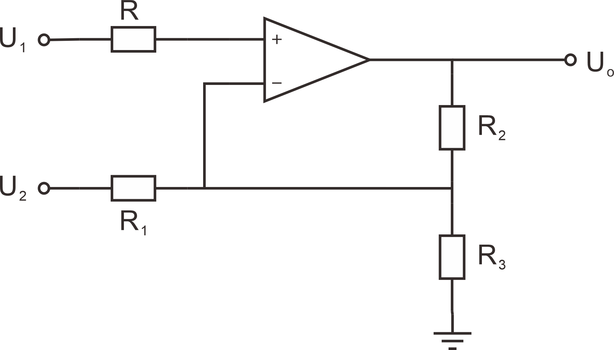

# 弥尔曼定理

## 一般形式

​		这是个不起眼的定理，本身原理十分简单，但在一定条件下非常有用

​		此时 $V_A$ 的表达式可以一步到位写出来，它就是**弥尔曼定理**：
$$
V_A = \frac{\frac{U_1}{R_1}+\frac{U_2}{R_2}+\cdots+\frac{U_n}{R_n}}{\frac1{R_1}+\frac1{R_2}+\cdots+\frac1{R_n}}
$$
​		**弥尔曼定理**是节点电压法的特殊情况，是电路的节点数只有2个的时候导出的。

## 特殊情况

在电路仅有两条支路的情况下也非常方便：

这个时候
$$
V_A = \frac{R_1V_2+R_2V_1}{R_1+R_2}
$$

## 用例

在下面这种情况，也可以简单粗暴地使用该公式

​		所以可以得出
$$
U_1 = \frac{\frac{U_2}{R_1}+\frac{U_o}{R_2}+\frac0{R_3}}{\frac1{R_1}+\frac1{R_2}+\frac1{R_3}}
$$

​		进而得到
$$
U_o = R_2\left(\frac1{R_1}+\frac1{R_2}+\frac1{R_3}\right)U_1-\frac{R_2}{R_1}U_2
$$
​		这样便省去了列方程的步骤，一步到位。