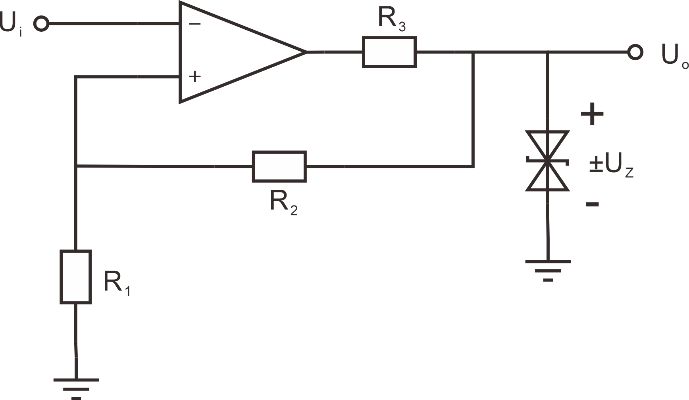
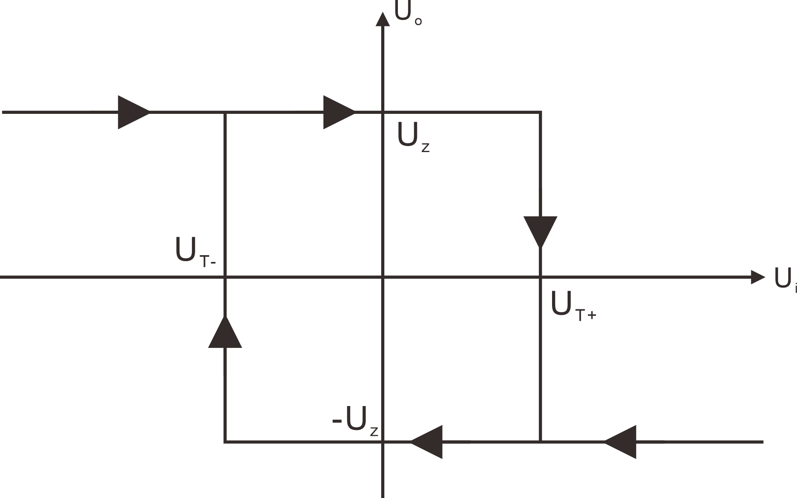

# 方波发生电路

## 滞回比较器（反相输入型）

​		如图所示电路

​		其中 $R_3$ 和双向稳压二极管构成了并联型稳压电路，正常情况下，该电路输出只有两种状态 $\mathrm{U_z}$ 或 $-\mathrm{U_z} $ 

​		假设理想运放同相输入端和反相输入端分别为 $V_p$ 和 $V_n$ ，其传输特性为
$$
U_o =
\left\{
\begin{align}
&\quad U_z &,& V_p>V_n\\
&-U_z&,&V_p<V_n
\end{align}
\right.
$$
​		电路输出发生跳变是在两输入端电位相等的那一刻
$$
V_p=V_n
$$
​		因此可以得到发生跳变时候 $\mathrm{U_i}$ 应满足的条件，即
$$
U_i = \frac{R_1}{R_1+R_2}U_o
$$
​		前面提到，电路输出电压只有两种状态，对应滞回比较器的两个门限电压。

​		规定小的为**下门限**电压，记作 $V_{T-}$ ，大的为**上门限电压**，记作 $V_{T+}$ 。
$$
\begin{align}
&V_{T-} = -\frac{R_1}{R_1+R_2}U_z\\[2mm]
&V_{T+} = \,\,\,\,\frac{R_1}{R_1+R_2}U_z
\end{align}
$$
​		滞回曲线如下图所示

（同相输入型的滞回比较器，其滞回曲线与此处的滞回曲线对称）

## 加入积分环节

