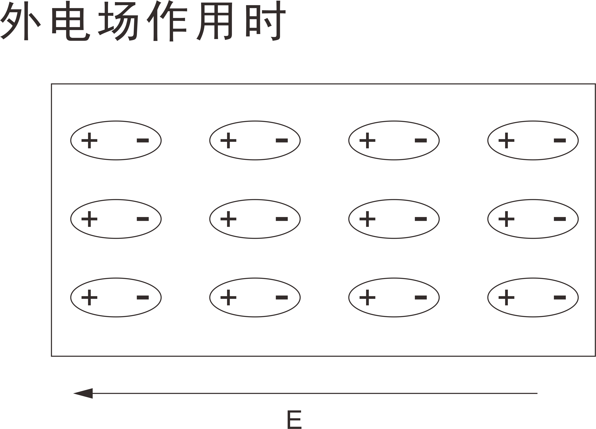
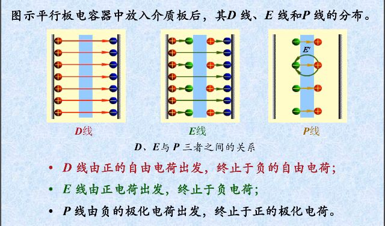

# 前言

​		学习《电磁场与电磁波》的时候，会运用到大量的数学方法，积分是计算方面的主要内容，同时有其他方面知识点贯穿其中，标量场、矢量场概念的引入是关键点，对于“场”概念的理解是基本。

​		原来我们学习的微积分只是“一维”的，而电磁场是传播于三维空间，我们无法避免接触多元的积分，而多元的积分比一元的要复杂不是一点点，无论是理解上还是计算上。空间中有多种积分形式，我们会见识到很多，而且他们之间有对应的变换关系，其中三个“度”是关键（梯度、散度、旋度）。

# 关联性猜想 (个人总结)

​		我们会注意到微分运算有了更多内涵，矢量的引入使得微分更加多元化，更加复杂化。

​		我们将**标量**和**矢量**两两组合，不难得到四种微分形式（当然不难猜测还有四种积分形式），如下所示
$$
\begin{align}
\frac{dy}{dx},\frac{d\vec{u}}{dt},\frac{d\vec{A}}{d\vec{l}},\frac{dS}{d\vec{A}}
\end{align}
$$
​		前面两种相信大家都见过了

​		第一种是最一般的微分，不做太多解释

​		第二种是矢量关于标量的微分，矢量同时具有**大小**和**方向**，而这两者都可以是关于变量 $t$ 的函数，因此矢量微分是可行的

​		而对于后两种微分，似乎并不常见，但其实我们见过第三种，在研究多元函数重积分的时候，我们用**雅可比行列式**来做积分变换，其实矢量对矢量的求导的结果就是**雅可比矩阵** 

​		这里我们需要将我们的认识上升一个台阶，将上述带箭头的符号看作矩阵而非矢量，将其元素视作标量或矢量，表示分布在空间中的每一点，这可能就是“矩阵论”和“场论”的妙处

​		以上仅仅代表我个人的猜想，作为笔记记录下来

# 第一章  矢量分析

## 标量与矢量

## 矢量的代数运算

## 矢量的标积和矢积

​		前三节内容的大部分，我们在以前高中时期就学过，因此不做太多描述，下面列出教材中与我们所学的不同的地方，以及补充，以做区分，我们主要还是以书本内容为主。

修正内容：

1. 矢量一般以粗体大小字母表示，如矢量 $\mathbf A$ ，其在空间中的坐标表示一般标注三个轴上的分量

   例如 ，$\mathbf A = (A_x,A_y.A_z)$ 

2. 单位向量以粗体e表示，其下标注明矢量对应的小写字母以做区分。

   例如，矢量 $\mathbf A$ 的单位向量为 $\mathbf e_a$ 

   其中，$\mathbf e_a=\frac{\mathbf A}{|\mathbf A|}$ 

3. 单位向量 $\mathbf e_a$ 还可以表示为

   $\mathbf e_a =\frac{A_x}{|A_x|}\mathbf e_x+\frac{A_y}{|A_y|}\mathbf e_y+\frac{A_z}{|A_z|}\mathbf e_z \\= \mathbf e_x\cos\alpha +\mathbf e_y\cos\beta+\mathbf e_z\cos\gamma$ 

   其中 $\cos\alpha,\cos\beta,\cos\gamma$ 被称为**方向余弦** 

补充内容：

1. 标量的空间分布构成标量场，矢量的空间分布构成矢量场。

2. 若矢量场的大小及方向均与坐标空间无关，这种矢量称为常矢量，简称**常矢**。

3. 标量三重积
   $$
   \vec A\cdot(\vec B\times \vec C)=\begin{pmatrix}
   A_x&A_y&A_z\\
   B_x&B_y&B_z\\
   C_x&C_y&C_z
   \end{pmatrix}
   $$
   表现为由三个矢量构成的平行六面体的体积

4. 矢量三重积
   $$
   \vec A\times(\vec B\times \vec C) = \vec B(\vec A\cdot \vec C)-\vec C(\vec A\cdot \vec B)
   $$
   表现为在矢量B和矢量C上的线性组合（其结果和矢量B矢量、C共面），注意次序！

   

注意事项：

1. 矢积不服从**交换律**和**结合律** （计算矢量三重积时特别注意）
2. 标积为零表**垂直**，矢积为零表**平行** 

## 标量场和矢量场

### 概念

“场”概念的引入：物理量（如温度、电场、磁场）在空间以某种形式分布，若每一时刻每个物理量都有一个确定的值，则称在该空间中确定了该物理量的场。

### 场的分类

按物理量的**性质**分：

1. 标量场：描述场的物理量为标量 （温度场，电势场）
2. 矢量场：描述场的物理量为矢量 （电场，磁场）

按物理量**变化特性**分：

1. 静态场：物理量不随时间发生变化的场 （静电场）
2. 时变场（动态场）：物理量随时间发生变化的场 （时变电场）

### 矢量与矢量场的不变特性

在任一时刻，描述场的物理状态分布的函数是**唯一**的，其大小、方向也是**唯一**的。
$$
常用坐标系\left\{
\begin{align}
&直角坐标系\\
&柱坐标系\\
&球坐标系
\end{align}
\right.
$$
如下所示
$$
\begin{align}
&\vec{F}(\vec{r})=\vec{F}(x,y,z)\\
&=F_x(x,y,z)\hat{a_x}+F_y(x,y,z)\hat{a_y}+F_z(x,y,z)\hat{a_z}\\
&=F_r(r,\phi,z)\hat{a_r}+F_\phi(r,\phi,z)\hat{a_\phi}+F_z(r,\phi,z)\hat{a_z}\\
&=F_R(R,\theta,\phi)\hat{a_R}+F_\theta(R,\theta,\phi)\hat{a_\theta}+F_\phi(R,\theta,\phi)\hat{a_\phi}
\end{align}
$$

## 坐标变换

我们主要学习直角坐标系和另外两种坐标系之间的转换

1. 直角坐标系  $(x,y,z)$
2. 圆柱坐标系  $(r,\phi,z)$
3. 球坐标系  $(r,\theta,\phi)$

其中要区分**标量坐标变换**和**矢量坐标变换**，前者坐标变换仅需替换坐标变量即可，而后者在前者的基础上加入了**方向**的要素，因此要对矢量的**各分量**进行变换

### 直角坐标系-圆柱坐标系

设矢量场 
$$
\vec{A}=A_x(x,y,z)\hat{a_x}+A_y(x,y,z)\hat{a_y}+A_z(x,y,z)\hat{a_z}
$$
坐标变量关系如下
$$
\left\{
\begin{align}
&r = \sqrt{x^2+y^2}\\
&\phi = \arctan(\frac y x)\\
&z = z
\end{align}
\right.
$$
矢量关系如下
$$
\begin{pmatrix}
A_r\\A_\phi\\A_z
\end{pmatrix}
=
\begin{pmatrix}
\cos\phi&\sin\phi&0\\
-\sin\phi&\cos\phi&0\\
0&0&1\\
\end{pmatrix}

\begin{pmatrix}
A_x\\A_y\\A_z
\end{pmatrix}
$$
得到变换后的表达式
$$
\vec{A}=A_r(r,\phi,z)\hat{a_r}+A_\phi(r,\phi,z)\hat{a_\phi}+A_z(r,\phi,z)\hat{a_z}
$$

### 直角坐标系-球坐标系

设矢量场 
$$
\vec{A}=A_x(x,y,z)\hat{a_x}+A_y(x,y,z)\hat{a_y}+A_z(x,y,z)\hat{a_z}
$$
坐标变量关系如下
$$
\left\{
\begin{align}
&R = \sqrt{x^2+y^2+z^2}\\
&\theta = \arccos(\frac{z}{\sqrt{x^2+y^2+z^2}})\\
&\phi = \arctan(\frac y x)
\end{align}
\right.
$$
矢量关系如下
$$
\begin{pmatrix}
A_R\\A_\theta\\A_\phi
\end{pmatrix}
=
\begin{pmatrix}
\sin\theta\cos\phi&\sin\theta\sin\phi&\cos\phi\\
\cos\theta\cos\phi&\cos\theta\sin\phi&-\sin\theta\\
-\sin\theta&\cos\phi&0\\
\end{pmatrix}

\begin{pmatrix}
A_x\\A_y\\A_z
\end{pmatrix}
$$
得到变换后的表达式
$$
\vec{A}=A_R(R,\theta,\phi)\hat{a_R}+A_\theta(R,\theta,\phi)\hat{a_\theta}+A_\phi(R,\theta,\phi)\hat{a_\phi}
$$

## 标量场的方向导数与梯度

​		套用维基百科定义，**梯度**是一种关于多元导数的概括

​		用我自己的理解概括，一元函数的梯度是标量，表示函数关于自变量的变化率

​		多元函数的梯度是矢量，其方向是函数值增长趋势最快的方向，其大小是多元函数函数值关于其所有分量的变化率（其中每一个分变量表示一个独立的矢量，总的变化率大小为该矢量的模）。

​		对于一个标量场函数 $\Phi(x,y,z)$ ，其梯度场记作 $\nabla\Phi$ 或 $grad(\Phi)$ ，其计算如下
$$
\nabla\Phi=\frac{\partial \Phi(x,y,z)}{\partial x}\hat{a_x}+\frac{\partial \Phi(x,y,z)}{\partial y}\hat{a_y}+\frac{\partial \Phi(x,y,z)}{\partial z}\hat{a_z}
$$

​		标量场在某点的方向导数，表示标量场($\Phi$)自该点($P$)沿某一方向上的变化率。

​		定义如下
$$
\left.\frac{\partial\Phi}{\partial l}\right|_P=\lim_{\Delta t\rightarrow 0}\frac{\Phi(P')-\Phi(P)}{\Delta t}
$$
​		标量场是连续分布在空间中的，其元素是数，表示空间中某个点某个物理量的一个度量

​		另外，方向导数也是一个数，是梯度在给定方向上的**投影**

​		给定单位方向矢量 $\vec{e_l}$ ，则标量场在 $P$ 点处沿 $\vec{e_l}$ 的方向导数为
$$
\left.\frac{\partial\Phi}{\partial l}\right|_P = \nabla\Phi(P)\cdot\vec{e}
$$

### 梯度、散度、旋度的复合运算

#### 梯度的旋度为零

(证明暂略)

#### 旋度的散度为零

(证明暂略)

#### 梯度的散度（拉普拉斯算子）

(暂不做要求)

#### 散度的梯度

(暂不做要求)

细节点评：

“有散场”强调的是该场存在散度，并没有否认其存在旋度，“有旋场”同理

# 第二章 电磁学理论基础

## 概念强化

### 场点

一个从原点指向空间中某一点的位置矢量，一般用 $r$ 表示。

### 源点

一个从原点指向**场源**的位置矢量，一般用 $r'$ 表示。

### 区分场点和源点（以电场强度的计算为例）

**为什么引入源点？为什么以前没有？**

​		高中时候学的静电场，我们总是以**点电荷**作为电场的源，而现在一般研究**连续带电体**。

​		点电荷的源是一个“点”，而计算这个点（源点）对空间中另一个点（场点）产生的影响的时候，我们只需考虑“源”的电荷量和两点之间的距离。

​		而连续带电体的源比起点则要复杂很多，我们需要引入**电荷分布**和**电荷密度**这两个概念。

​		点电荷的特点是**无穷小的体积，无穷大的电荷密度，有限的电荷量**，其实这是一个三维形式的狄拉克函数，而更一般情况下带电体不会如此“理想”，它们一般具有形状，而电荷产生的电场是和点电荷之间的相对位置有关的。

​		下面看关于电场强度的表达式
$$
\vec{E}(r)=\frac1{4\pi \varepsilon_0}\int \frac{\rho(r')}{R^2}\hat{a_R}\,d\sigma'
$$
​		$\rho$ 为电荷密度，该密度是关于源点的函数；$\sigma'$ 是对应于 $\rho$ 的积分元（线元、面积元、体积元）。

​		$R=|r-r'|$ ，是从源点指向场点的矢量的距离。

​		$\hat{a_R}$ 是从源点指向场点的矢量的方向。

> ​		一般情况下，$\hat{a_R} ,R,\rho,\sigma'$ 都是和 $r'$ 有关的变量，比如在电荷为面分布的情况下，以球坐标系为例 $d\sigma'= r'^2\sin\theta \,d\theta\,d\phi$ ，$R=|r-r'|$ ，单位矢量 $\hat{a_R}$ 则需要分解为球坐标矢量的线性组合，这中间有个投影的过程，其投影角可以借助**余弦定理**转换成关于 $r'$ 的表达式。
>
> ​		常用变形式：$\nabla(\frac1R)=-\frac1{R^2}\hat{a_R}$

## 电场强度

电场强度的计算在上面一栏已经说明，下面是关于其定义的一些补充。

### 第一定义

$$
\vec{E}=\frac{\vec{F}}{q}
$$
​		其中 $q$ 是试验电荷的电量，其和场源电荷 $Q$ 的关系应满足 $q\ll Q$ ，即试验电荷不应影响场源电荷产生的电场。（可以看出这个定义的条件是非常苛刻的）

### 第二定义

$$
\vec{E}=-\nabla \Phi
$$
​		在这里 $U$ 是电势场，电场强度就是电势场的**梯度场** 。

​		电场强度的单位是 $\mathrm V/\mathrm m$ ，从量纲上也不难理解这个它的合理性。

> ​		个人比较喜欢写作 $\vec{E}=-\nabla U$ 											——尼斯湖水怪

## 库仑定律

假设空间中有两个点电荷，电量分别为 $q_1,q_2$ 其相互作用力 $F$ 的大小为
$$
F=\frac{q_1q_2}{4\pi \varepsilon_0 r^2}
$$
以上是偏向高中静电场的描述，下面是《电磁场与电磁波》形式的描述

​		假设空间中有两个点电荷，电量分别为 $q_1,q_2$ ，其中 $r'$ 为指向 $q_1$ 的位置矢量(视作源点)，$r$ 为指向 $q_2$ 的位置矢量(视作场点)，因此 $q_2$ 收到 $q_1$ 的电场力的大小 $\vec{F_{12}}$ 为
$$
\vec{F_{12}}=\hat{a_R}\frac{q_1q_2}{4\pi \varepsilon_0 R^2}=-\vec{F_{21}}
$$
其中 $R=r-r'$ ，$\hat{a_R}$ 为 $R$ 的单位向量，定义为 $\hat{a_R}=\frac{r-r'}{|r-r'|}$ 

对比两者不难发现，后者对前者进行了扩充，引入矢量和场点源点的概念。

## 电位的计算

单位正电荷从P点移动到A点外力所做的功，称为A点和B点之间的电位差。
$$
\phi_{AP}=-\int_P^A\vec{E}\cdot d\vec{l}
$$

> 这样定义实在很绕，个人习惯这样定义：
>
> 单位正电荷从A点移动到B点电场力所做的功，称为A点和B点之间的电位差。
> $$
> \phi_{AB}=\int^B_A \vec{E}\cdot d\vec{l}
> $$

## 磁通连续性原理

​		该原理为构成**麦克斯韦方程组**的其中一部分，表达式为
$$
\oint_S \vec{B}\cdot d\vec{S} = 0
$$
​		对于**通量**概念，最能把握其本质的描述是**穿过指定面的场线数量**，只是这里的这个**数量**的概念是连续的，并不是个自然数，而可以是非整数非正数。

​		通量的正负是取决于**场线的方向**和**有向面积元的方向**的夹角，符合余弦规律。因此对于同一“穿入”和“传出”的场线会发生**抵消**。

​		由于磁场是空间中闭合的曲线，其与封闭面之间的几何关系，无外乎四种情况。

1. 相离：磁场线和封闭面不接触，积分为0

2. 包含：磁场线在封闭面上，由于在各点位置场线元与面积元方向始终垂直，内积始终为0，因而积分为0

3. 相交：由于磁场线是闭合的，穿出封闭面的磁场线必然会穿入回封闭面，这两部分发生抵消，积分始终为0

   

   **注意**：通量为0必须强调是对**封闭面**而言，假如不是封闭面，通量不一定为0

根据散度定理
$$
\oint_S \vec{B}\cdot d\vec{S}=\iint_V (\nabla\cdot\vec{B})\,dV=0
$$
因此可知磁场的散度为0

> ——磁通连续性原理说明了磁场是无散场。

# 第三 媒质的电磁特性

## 导体的特性

### 导体的定义

​		含有大量可以自由移动的带电粒子的物质。

导体分为两种：

1. 金属导体：由自由电子导电
2. 电解质导体：由带电离子导电

## 处于静电平衡的导体

具备以下四个特点

1. 导体为等势体
2. 导体内部电场为零
3. 导体表面的电场处处与导体表面垂直，切向电场为零
4. 感应电荷只分布在导体表面上，导体内部感应电荷为零

## 电介质的特性

电介质是绝缘的，在外电场作用下不能发生传导现象，可以发生极化现象

电介质的分子分为两种类别
1. 无极分子：当外电场不存在的时候，介质中分子的正负电荷“重心”是重合的。
2. 有极分子：当外电场不存在时，介质中分子的正负电荷“重心”不重合，每个分子可以等效为一个电偶极子。

### 极化现象

1. 位移极化：无极分子的正负电荷“重心”发生相对移动，形成等效电偶极子。
2. 取向极化：有机分子发生的电偶极矩发生转动，转向沿电场线的方向。

（上述的“重心”是指电量分布的中心，而非质量分布的中心）

> ​		电介质的极化会建立内电场反抗原电场，使得原电场强度减弱。用无极分子的极化来举例：
>
> 
>
> 这个时候，每个分子维持电中性
>
> 
>
> 
>
> ​		无极分子产生位移极化，其结果在电介质的内部，产生了方向从左向右的内电场 ( 这个电场对应的电位移矢量就是 $\vec{P} $ ) ，与外加电场 E 的方向相反，叠加起来，导致电介质内部的场强衰减。
>
> > ​		和电介质不一样的是，孤立的导体内全是自由电荷，因此在外电场作用的第一时间，自由电荷就会在导体的两端堆积，其结果就是产生内电场，这个内电场会**完全抵消**外电场的作用，大小相同方向相反，这个时候的导体所处的状态就是所谓的“静电平衡”，这是导体与电介质最大的不同。

### 极化强度

描述电介质极化程度的物理量。

#### 定义

单位体积中分子电矩的矢量和，单位 $\mathrm C/\mathrm m^2$。
$$
\vec{P} = \lim_{\Delta V\rightarrow0}\frac{\sum_i \vec{p_i}}{\Delta V}
$$
极化强度与电场强度成正比
$$
P\propto \varepsilon_0E
$$

### 束缚电荷（补充）

电介质中体积 $V'$ 内的全部电偶极子，在场点 $A$ 产生的电位。
$$
\phi_A - \frac1{4\pi\varepsilon_0}\left[ \oint_{S'}\frac{\vec{P}
\cdot d\vec{S'}}{R}+\int_{V'}\frac{\nabla'\cdot \vec{P}}{R}dV' \right]
$$
其中 $S'$ 是体积 $V'$ 对应的封闭面

> 束缚电荷的计算非常复杂，估计不会作为重点，至少不会让我们用这种方式去求。

### 电介质的物态方程

根据高斯定理
$$
\nabla\cdot(\varepsilon_0\vec{E})=\rho_V+\rho_P=\rho_V+(-\nabla\cdot\vec{P})
$$
因此
$$
\nabla\cdot(\varepsilon_0\vec{E}+\vec{P})=\rho_V
$$
因此电位移矢量 $\vec{D}=\varepsilon_0\vec{E}+\vec{P}$ ，其中 $\vec{P}=X_e\varepsilon_0\vec{E}$ ，$X_e$ 称为极化系数。

又写作 $\vec{D}=(1+X_e)\varepsilon_0\vec{E}=\varepsilon_r\varepsilon_0\vec{E}$ ，相对介电常数 $\varepsilon_r$ 就是这么来的。

> ​		电位移矢量 $\vec{D}$ 可以理解为两部分的和， $\varepsilon_0\vec{E}$ 为电场 $\vec{E}$ 在真空中的电位移矢量，而 $\vec{P}$ 是在电介质中由极化电荷产生的反向的电位移矢量，两者叠加是消弱的，总的电位移 $|\varepsilon_0\vec{E}+\vec{P}|<|\varepsilon_0\vec{E}|$ ，叠加后得到的是“自由电荷”产生的电位移，这样上式就不难理解了。
>
> ​		最最最最最重要的一点，在标准的定义中，$\vec{P}$ 的参考方向和 $\vec{E}$ 是一致的，看下图
>
> 
>
> ​		如此的定义就满足了 $\vec{D}=\varepsilon_0\vec{E}+\vec{P}$ 的形式，但要注意，这里的 $\vec{P}$ 的标量部分肯定是负的。
>
> ​		回过头来看这个不等式：$|\varepsilon_0\vec{E}+\vec{P}|<|\varepsilon_0\vec{E}|$ 。乍一看似乎不满足上图的叠加关系，$\vec{D}$ 的场线应该比 $\varepsilon_0\vec{E }$ 的场线要长才对？为什么 $|\varepsilon_0 \vec{E}|$ 的模反而更大？这其实是由于 $\vec{P}$ 的参考方向与实际方向不一致导致的错觉（从负极指向正极）。
>
> ​		假如三个量在一条直线上，标量式应该会写作
> $$
> |\vec{D}|=\varepsilon_0|\vec{E}|-|\vec{P}|
> $$

