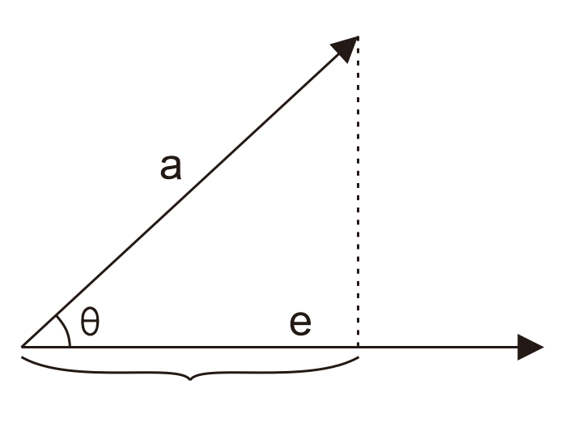
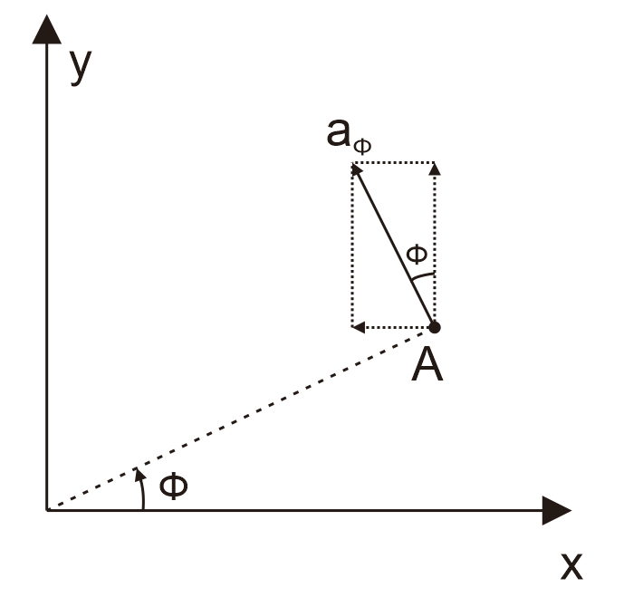

# 矢量坐标变换
## 点积
矢量 $\vec{a}$ 与矢量 $\vec{b}$ (假设两者夹角为$\theta$) 的点积定义为
$$
\vec{a}\cdot\vec{b}=|\vec{a}||\vec{b}|\cos\theta
$$
## 从点积到坐标变换

### 一维的坐标变换

#### 抛砖引玉

假如令矢量 $\vec{b}$ 为某个单位向量，我们以单位向量 $\vec{e}$ 作为参考角度，向量的点积具有更深层次的含义
$$
\vec{a}\cdot\vec{e}=|\vec{a}|\cos \theta_a
$$
点积的结果得到了矢量 $\vec{a}$ 在矢量 $\vec{e}$ 方向上的**投影**

投影的含义就是某个方向上矢量的长度，在另一个矢量上的长度

在上述例子中，矢量 $\vec{a}$ 的长度为 $|\vec{a}|$ ，而投影到 $\vec{e}$ 上之后长度变为了 $|\vec{a}|\cos\theta_a$

**这就是最简单情况下的坐标变换**

#### 归纳

我们用两个单位矢量来分别表示两个坐标轴，x 轴是 $\vec{a_x}$，y轴是 $\vec{a_y}$

假如有一个x轴上的矢量 $\vec{A} = A_{x}\vec{a_x}$ 要将其变换到y轴上，(假设在y轴上的投影为 $A_y$) 仅仅需要将 $\vec{A}$ 与y轴的单位矢量做**点积**
$$
A_y=\vec{A}\cdot \vec{a_y} = A_x \vec{a_x}\cdot\vec{a_y}
$$
这里我们并没有规定 x 轴和 y 轴是垂直的关系，我们追求的是更加一般的坐标形式，不要与直角坐标系混淆

因此 $\vec{a_x}\cdot\vec{a_y}$ 一般不为0 ，其结果是某个缩放因子，表征了投影到另一个轴后，长度的变化情况，这个缩放因子和一些变量可能构成函数关系，但因为该例是一维的情况，所以可以视为常数

## 球坐标-直角矢量坐标变换

其公式为
$$
\begin{pmatrix}
A_x\\A_y\\A_z
\end{pmatrix}
=
\begin{pmatrix}
\sin\theta\cos\phi&\sin\theta\sin\phi&\cos\theta\\
\cos\theta\cos\phi&\cos\theta\sin\phi&-\sin\theta\\
-\sin\phi&\cos\phi&0
\end{pmatrix}
\begin{pmatrix}
A_r\\A_\theta\\A_\phi
\end{pmatrix}
$$
这个公式颇为复杂，为了便于记忆，首先尝试理解下面每一个内积的含义
$$
\begin{align}
&
a_x\cdot a_r = \sin(\theta)\cos(\phi)
&&
a_y\cdot a_r = \sin(\theta)\sin(\phi)
&&
a_z\cdot a_r = \cos(\theta)
\\
&
a_x\cdot a_\theta = \cos(\theta)\cos(\phi)
&&
a_y\cdot a_\theta = \cos(\theta)\sin(\phi)
&&
a_z\cdot a_\theta = -\sin(\theta)
\\
&
a_x\cdot a_\phi = -\sin(\phi)
&&
a_y\cdot a_\phi = \cos(\phi)
&&
a_z\cdot a_\phi = 0
&&
\\

\end{align}
$$

### 第一行

上述内积表达式的第一行，是将**径向矢量**分别投影到 x y z 三个轴上，其表达式与球坐标系的**参数方程**类似
$$
\left\{
\begin{align}
x&=R\sin\theta\cos\phi\\
y&=R\sin\theta\sin\phi\\
z&=R\cos\theta\\
\end{align}
\right.
$$
只需要将等式两边同除以 $R$ 即可得到它们的方向余弦，与上述内积表达式的第一行完全一致
$$
\left\{
\begin{align}
\cos\alpha&=\sin\theta\cos\phi\\
\cos\beta&=\sin\theta\sin\phi\\
\cos\gamma&=\cos\theta\\
\end{align}
\right.
$$

### 第二行

同理，内积表达式的第二行是将**旋转矢量**分别投影到 x y z 三个轴上，该矢量的方向是垂直于径向矢量的，表征一种旋转的趋势，其中 $\theta$ 与 $\phi$ 所表征的旋转是相正交的。若用地球的经纬度来理解，$\theta$ 相当于经线坐标，$\phi$ 相当于纬线坐标

上述内积表达式的第二行与第一行的不同在于将 $\sin\theta$ 换成了 $\cos\theta$ ，将 $\cos\theta$ 换成了 $-\sin\theta$ ，这恰恰构成一组关于 $\theta$ 的正交关系

### 第三行

由于 $\phi$ 表征的是在 $xOy$ 平面上的旋转量，所以其投影系数更为简单，在 z 轴上的分量为0

但是要注意 $\phi$ 的方向是规定从 x 轴旋转到 y 轴，这样一来在 x 方向上的分量实际是负的

### 其他特征

对于这个表达式要注意变换方向，要注意

到底是 “从 x y z 变换到 $r\,\theta\,\phi$ ”

还是 “从 $r\,\theta\,\phi$ 变换到 x y z ”

在这里补充原式的**逆变换**
$$
\begin{pmatrix}
A_r\\A_\theta\\A_\phi
\end{pmatrix}
=
\begin{pmatrix}
\sin\theta\cos\phi&\cos\theta\cos\phi&-sin\phi\\
\sin\theta\sin\phi&\cos\theta\sin\phi&\cos\phi\\
\cos\theta&-\sin\theta&0
\end{pmatrix}
\begin{pmatrix}
A_x\\A_y\\A_z
\end{pmatrix}
$$
对比原变换不难发现
$$
\begin{pmatrix}
A_x\\A_y\\A_z
\end{pmatrix}
=
\begin{pmatrix}
\sin\theta\cos\phi&\sin\theta\sin\phi&\cos\theta\\
\cos\theta\cos\phi&\cos\theta\sin\phi&-\sin\theta\\
-\sin\phi&\cos\phi&0
\end{pmatrix}
\begin{pmatrix}
A_r\\A_\theta\\A_\phi
\end{pmatrix}
$$
两个矩阵应该**互逆**而且互为**转置**

可见这是一个**正交变换**

# 梯度、散度、旋度

## 梯度的柱坐标表达式

## 梯度的球坐标表达式
