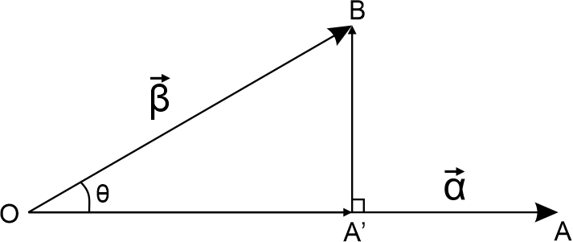

# 施密特正交化

## 基本原理

​		如图所示，其中 $\vec{\alpha}$ 为从点 $\mathrm O$ 到点 $\mathrm A$ 的向量， $\vec{\beta}$ 为从点 $\mathrm O$ 到点 $\mathrm B$ 的向量，它们的夹角为 $\theta$ 

​		

​		施密特正交化的原理就是提取向量 $\vec\beta$ 与 $\vec\alpha$ 相**正交**的分量 $\stackrel{\longrightarrow}{\mathrm{A'B}}$ ，而舍去**平行**分量 $\stackrel{\longrightarrow}{\mathrm{OA'}}$ ，从而简化向量组的构成。
$$
\stackrel{\longrightarrow}{\mathrm{A'B}}\ =\ \stackrel{\longrightarrow}{\mathrm{OB}} - \stackrel{\longrightarrow}{\mathrm{OA'}}\\
$$
​		其中向量 $\stackrel{\longrightarrow}{\mathrm{OA'}}$ 是向量 $\vec\beta$ 在向量 $\vec\alpha$ 方向上的**投影** ，因为我们知道
$$
\vec\alpha \cdot \vec\beta = |\vec\alpha||\vec\beta|\cos\theta
$$
​		因此向量 $\stackrel{\longrightarrow}{\mathrm{OA'}}$ 的**长度**可写作
$$
\left|\stackrel{\longrightarrow}{\mathrm{OA'}}\right|\ =\ |\vec\beta|\cos\theta = \frac{\vec\alpha \cdot \vec\beta}{|\vec\alpha|}
$$
​		然后再考虑向量 $\stackrel{\longrightarrow}{\mathrm{OA'}}$ 的**方向**，只需要乘上一个 $\vec\alpha$ 的单位向量 $\vec{e} $ 即可，即
$$
\vec{e} = \frac{\vec\alpha}{|\vec\alpha|}
$$
​		所以向量 $\stackrel{\longrightarrow}{\mathrm{OA'}}$ 可以由原来的两个向量 $\vec\alpha$ 和 $\vec\beta$ 唯一确定：
$$
\stackrel{\longrightarrow}{\mathrm{OA'}}\ =\ \left|\stackrel{\longrightarrow}{\mathrm{OA'}}\right|\, \vec e\ = \ \frac{\vec\alpha \cdot \vec\beta}{|\vec\alpha|}\,\frac{\vec\alpha}{|\vec\alpha|} = \ \frac{\vec\alpha \cdot \vec\beta} {\vec\alpha\cdot\vec\alpha}\times \vec\alpha
$$
​		因此我们待求的向量 $\stackrel{\longrightarrow}{\mathrm{A'B}}$ ，现在记作 $\vec{\beta_\perp}$ ，可以写作
$$
\vec{\beta_\perp} = \vec\beta - \frac{\vec\alpha \cdot \vec\beta} {\vec\alpha\cdot\vec\alpha}\times \vec\alpha
$$
​		可以验证 $\vec{\beta_\perp}\perp \vec\alpha$ ，此时已经完成了**正交化**，为了进一步简化向量组，需要将正交化后的向量组进行**单位化**，即使其**模**缩放为1
$$
\vec{\beta'} = \frac{\vec{\beta_\perp}}{|\vec{\beta_\perp}|}
$$
​		这里我只介绍了二维空间向量组的正交化，即将**两个**向量正交化，如果在三维空间，就有三个两两正交的向量作为**基向量**，最典型的就是我们高中数学空间解析几何中的 { $\vec i$ , $\vec j$ , $\vec k$ } 了。
$$
\vec i = 
\begin{pmatrix}
1\\0\\0
\end{pmatrix}
\qquad
\vec j = 
\begin{pmatrix}
0\\1\\0
\end{pmatrix}
\qquad
\vec k = 
\begin{pmatrix}
0\\0\\1
\end{pmatrix}
$$
​		将它们构成一个3阶方阵，正好是一个单位矩阵，是一个最简单的正交矩阵。

​		总而言之，施密特正交化就是将一“线性无关的向量组”标准化为“其中向量两两正交的向量组”，从平面几何上理解，就是将一个平行四边形(扭曲的正方形)拉伸为一个边长为1的标准正方形。