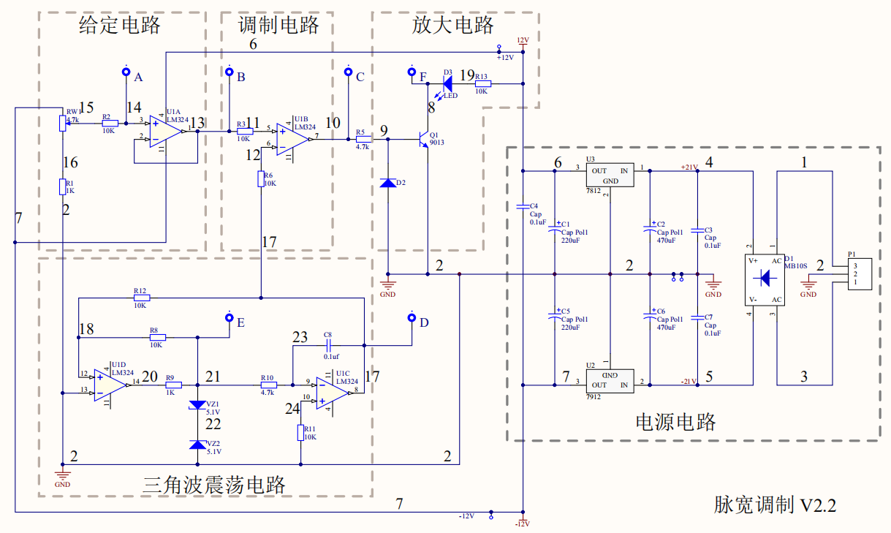
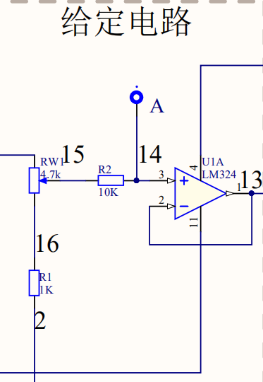
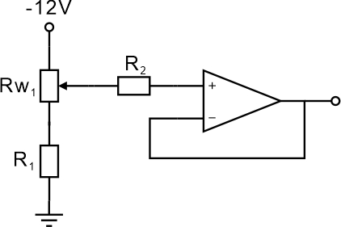
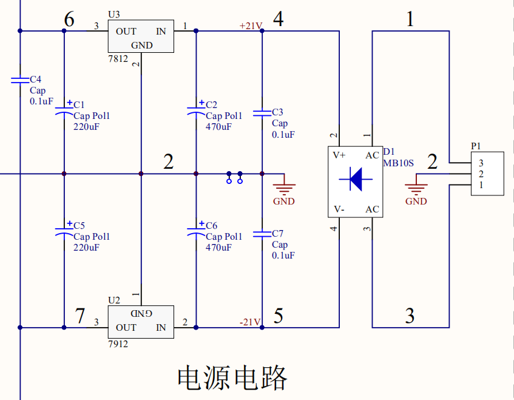
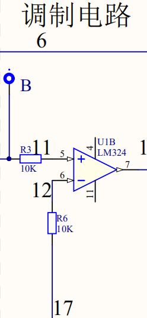
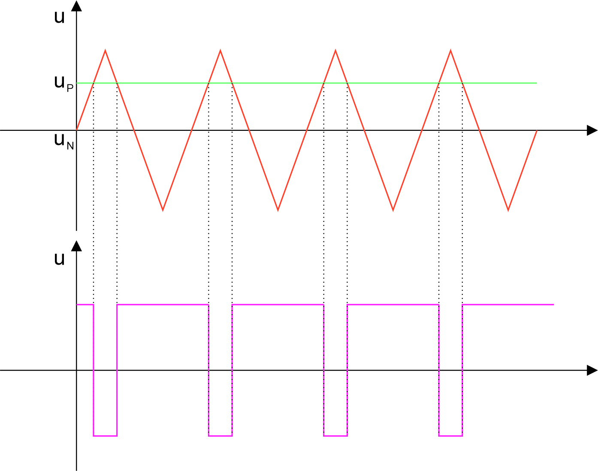
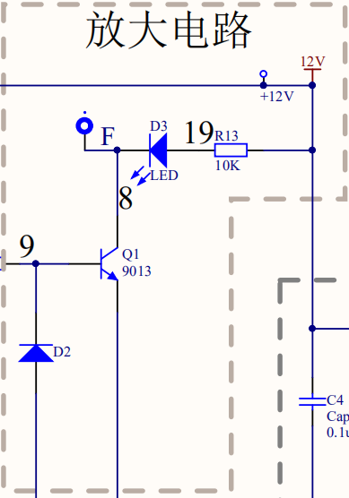
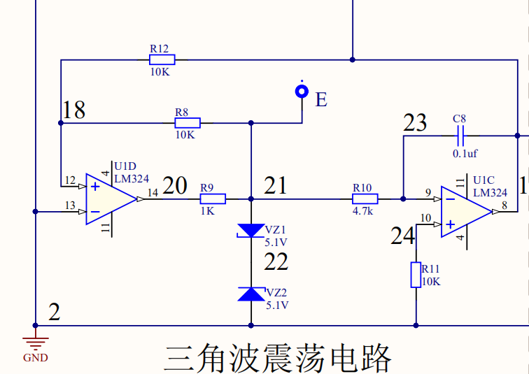
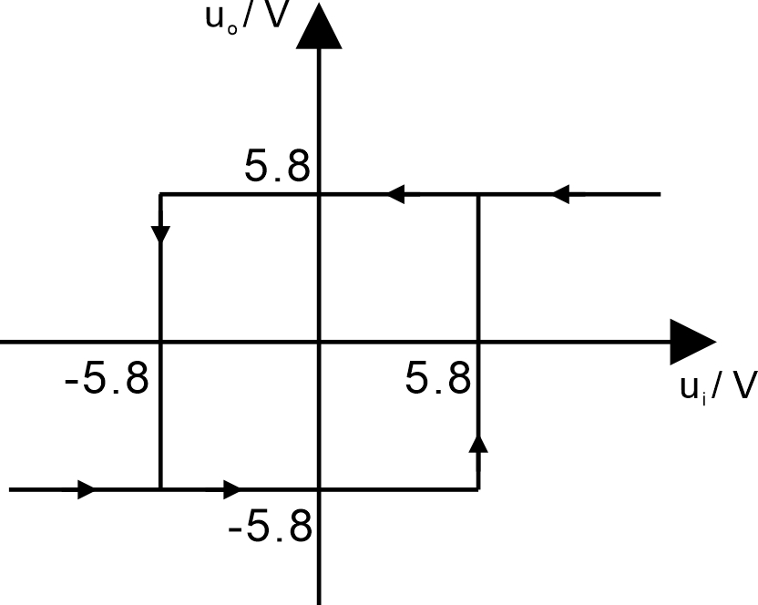

# 完整电路图

## 可调输入电压

​		连接形式整理如下

​		使用变阻器分压得到一个输入电压，加入一级电压跟随器以实现前后隔离。

## 电源电路

​		由市电通过变压器转为低压交流电，作为电源输入。

​		通过桥堆整流得到脉动的直流电，再经过7812和7912集成稳压块进行稳压，获得稳定的 $\pm 12 \mathrm V$ 双电源。

## 调制电路

​		调制电路是一个比较器，其反相输入端是由三角波振荡电路产生的三角波，其同向输入端是前面的可调输入电压。

​		由于三角形一头尖一头粗，对于不同的水平线截得的高低电平持续时间也不同，因此达到了调节脉宽的效果，如下图所示

​		通过改变 $\mathrm{u_p}$ 大小，可以调节输出矩形波的占空比，通过图像可以判断，$\mathrm{u_p}$ 越大占空比越大；$\mathrm{u_p}$ 越小占空比越小。

## 放大电路

​		使用二极管对9013进行偏置，保证三极管正常放大。

​		通过三极管的集电极来驱动LED发光，$\mathrm R_{13}$ 是限流电阻。

## 三角波振荡电路

​		前级是一个滞回比较器，可以画出其电压传输特性图（假设VZ正向导通 $0.7\mathrm V$）

​		然后后面是个积分电路，将滞回比较器产生的方波变换为三角波，同时回传到前面作为输入信号，构成了自激振荡。